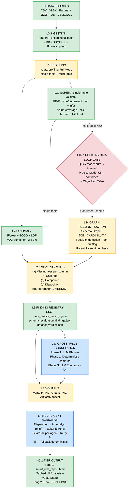
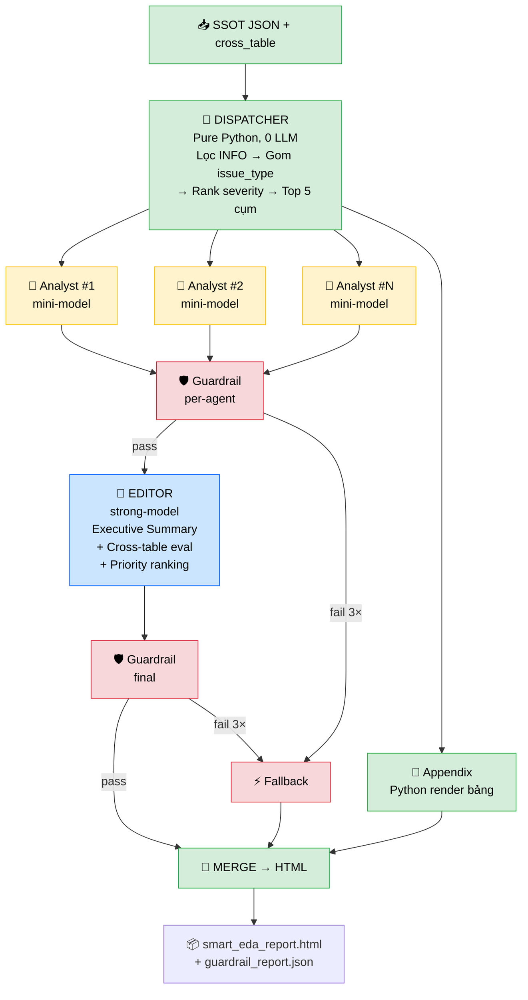

# ARCHITECT.md — Smart EDA / VSF-EDA (v5.4)

> **Tài liệu này là SSOT (Single Source of Truth) kỹ thuật.** Tự đủ: đọc một mình nó là tái dựng được phương pháp luận, logic và pipeline end-to-end. **Code, file, thảo luận chỉ là tham chiếu** — code lệch tài liệu thì code sửa theo tài liệu.
>
> **Quy ước đọc:**
> - Tài liệu mô tả **THIẾT KẾ ĐÍCH (normative)** — hệ thống *phải* làm gì. Việc đã code hay chưa được thể hiện bằng **nhãn trạng thái**, không làm đổi đặc tả.
> - **Trạng thái:** ✅ đã code & khớp · 🔧 chưa code hoặc code đang khác · 📋 thuộc tier sau (đã thiết kế, chưa tới lượt).
> - **Maturity của mọi ngưỡng số** (xem Mục 11): `Heuristic` → `Benchmark-Validated` → `Production-Validated`. Hiện **toàn bộ = Heuristic** cho tới khi có Benchmark Suite (Tier 1).
> - **Build tier** (Mục 13): mỗi component gắn Tier 0/1/2/3. Đường tới-hạn MVP = **Tier 0**.
>
> **Bốn nguyên tắc bất biến (khoá cứng, mọi tầng tuân):**
> 1. **No-sampling.** Toàn hệ xử lý **toàn bộ** dữ liệu. OOM trên dữ liệu cực lớn được chấp nhận (người dùng chịu phần cứng). *(Gỡ tận gốc C2, H3.)*
> 2. **Deterministic-First, LLM-Last.** Máy tính ra mọi con số & quyết định; **LLM chỉ diễn đạt/xếp hạng cái máy đã tính**, không bao giờ là nguồn sự thật cho finding/severity/verdict/quan hệ/nguyên nhân.
> 3. **Hard-blocker luôn thắng.** Một lỗi CRITICAL → NOT_READY bất kể luật khác. Không cơ chế nào (density, compound) được *làm loãng* severity, chỉ leo **LÊN**.
> 4. **OBSERVED không bị cap bởi provenance.** Mức nghiêm trọng *đo trực tiếp* (vd % thiếu) không bao giờ bị giảm vì "không chắc cơ chế". Provenance chỉ giới hạn độ chắc của **kết luận suy diễn**.

## Mục lục
- **I. Định hướng:** [1. Hệ thống làm gì](#1-hệ-thống-làm-gì) · [2. Vấn đề](#2-vấn-đề) · [3. Triết lý & 3 trục](#3-triết-lý--ba-trục-độc-lập)
- **II. Pipeline:** [4. Sơ đồ end-to-end](#4-sơ-đồ-end-to-end) · [5. Đặc tả từng tầng](#5-đặc-tả-từng-tầng-inputlogicoutput)
- **III. Cơ chế ngang:** [6. Threshold Registry](#6-threshold-registry--maturity) · [7. Metadata Layer](#7-metadata-layer-business-impact) · [8. Guardrail & Provenance](#8-guardrail--provenance)
- **IV. Hợp đồng & số:** [9. Data Contracts](#9-data-contracts) · [10. Thuật toán & ngưỡng](#10-thuật-toán--ngưỡng)
- **V. Rủi ro & lộ trình:** [11. Triage](#11-triage--known-issues--risks-canonical) · [12. Build tiers](#12-build-tiers) · [13. Recognized components](#13-recognized-components) · [14. Ma trận trạng thái](#14-ma-trận-trạng-thái-thực-thi)
- **VI. Tham khảo:** [15. Từ điển](#15-từ-điển) · [16. Changelog](#16-changelog)

---

# I. ĐỊNH HƯỚNG

## 1. Hệ thống làm gì

Smart EDA là **máy kiểm định chất lượng dữ liệu**: nuốt một/nhiều file (hoặc DB), **đo bằng code xác định**, sinh các artifact JSON chẩn đoán + một **verdict `READY / WARN / NOT_READY`**, rồi để **LLM viết lời giải thích** chỉ dựa trên JSON đó. Mục tiêu: một phán quyết **trung thực và giải thích được** về việc dữ liệu đã sẵn sàng dùng chưa — không phải "ML-ready" (xem giới hạn ở Mục 11 & 13).

## 2. Vấn đề

Công cụ EDA hiện có (ydata, sweetviz, dataprep…) tính thống kê nội-bảng rất tốt nhưng: (a) không phán quyết "dùng được chưa", (b) tính mọi tương quan kể cả vô nghĩa, (c) không phân tích chéo bảng đúng cách, (d) nếu có AI thì để AI **bịa** kết luận không kèm bằng chứng. Smart EDA lấp các khoảng đó với ràng buộc **không nói dối**.

## 3. Triết lý & ba trục độc lập

**"Máy đo số, AI viết lời."** Mọi con số do Python/ML tính (xác định, tái lập); LLM chỉ là tầng diễn đạt cuối, bị **Guardrail** chặn nếu nói gì không có trong JSON bằng chứng.

**Ba trục tách rời — KHÔNG được gộp thành một số** (mọi finding & verdict mang cả ba):

| Trục | Trả lời | Ví dụ |
|---|---|---|
| **Severity** | Tác động nặng cỡ nào | `CRITICAL` |
| **Confidence** | Hệ thống chắc cỡ nào | `0.25` |
| **Provenance** | Kết luận từ đâu | `OBSERVED` (đo) / `INFERRED` (suy luận) / `INDETERMINATE` (không xác định được) |

Cho phép `severity=CRITICAL, confidence=0.25, provenance=INFERRED` — severity **không** được ám chỉ confidence. (Mục 9 = data model, Mục 8 = cách Guardrail dùng provenance.)

---

# II. PIPELINE

## 4. Sơ đồ end-to-end



**Chú thích màu:** 🟢 done = đã code & khớp · 🟡 wip = chưa code hoặc đang khác · 🔵 planned = thiết kế xong, chưa tới lượt · 🔴 gate = cổng user can thiệp.

<details>
<summary>📋 Sơ đồ text (bản chi tiết — bấm để mở)</summary>

```
DATA SOURCES (CSV/XLSX/Parquet/JSON · DB·DBML/SQL)
 │
 ▼ L0 INGESTION — no-sampling ✅
 │   readers (encoding fallback) · DB→DBML+CSV (match-by-construction)
 │
 ▼ L1 PROFILING — Full, KHÔNG sampling (ydata) · single & multi  🔧 (multi đang minimal)
 │
 ▼ L2a ANOMALY — IForest+ECOD+LOF, max-combiner, z≥3.0 (Heuristic)  ✅
 │   z-score = EVIDENCE, KHÔNG phải Decision (P7). chỉ loại cột HẰNG, giữ cột số liên tục (A1✅)
 │
 ▼ L2b SCHEMA single-table — validate (PK/FK/type/unique/not_null) + infer  ✅
 │   value-coverage · KHÔNG Jaccard · KHÔNG LLM
 │
 ▼ L2b.5 HUMAN-IN-THE-LOOP GATE (multi-table)  📋 Tier0
 │   Quick Mode (CLI): L2b tự chốt, gắn cờ `schema_status=inferred` → bỏ qua gate
 │   Precise Mode (Web UI): UI hiển thị gợi ý PK/FK → user xác nhận → `schema_status=confirmed`
 │   User chọn Fact Table ở đây (gợi ý mặc định bằng heuristic)
 │
 ▼ L2c GRAPH RECONSTRUCTION (multi-table)  🔧 ◀ trước L2.5
 │   Schema Graph + Relationship Graph (cạnh = quan hệ ĐÃ kiểm chứng hoặc user-confirmed)
 │   JOIN_CARDINALITY ∈ {1:1, 1:N, N:N} · Fact/Dimension detection · Fan-out flag (P1)
 │   Parent PK runtime uniqueness check · emit NON_UNIQUE_PARENT_PK nếu vi phạm
 │
 ▼ L2.5 SEVERITY STACK
 │   (a) missingness per-column effect-size → MAR / MCAR_CONSISTENT / INDETERMINATE  🔧 ◀ H5
 │   (b) calibrator: Finding Severity (gốc, bất biến); chỉ MAR leo thang  🔧 ◀ H5
 │   (c) compound: nâng EFFECTIVE severity cấp-CỘT (loại INFO, ≥2≥WARN); cap +1 (P10)  ✅core/🔧cải tổ
 │   (d) disposition (BLOCK/PREPROCESS/REVIEW/SIGNAL) ✅
 │   (e) aggregator → VERDICT: hard-blocker ✅ + luật mật độ WARN  🔧 ◀ M1
 │
 ▼ L3 FINDING REGISTRY → SSOT CONTRACTS  ✅core/🔧registry
 │   MỌI artifact = projection từ MỘT Finding Registry. KHÔNG file nào tự tính lại severity/verdict
 │   data_quality_findings.json · schema_evaluation_findings.json · dataset_verdict.json
 │   guardrail_report.json · artifact_manifest.json
 │      │
 │      ▼ L3b CROSS-TABLE CORRELATION (chỉ multi-table)  📋 Tier0
 │        Phase 1: LLM Planner → chọn cặp cột + cách aggregate (1 API call)
 │        Phase 2: DETERMINISTIC → aggregate-before-join → phik/spearman · N=parent rows
 │        Phase 3: LLM Evaluator (tích hợp L4) → đánh giá + narrative
 │        Validation layer chống hallucination · skip N<30 · skip null-overlap>70%
 │        → cross_table_correlations.json (provenance=DERIVED_CROSS_TABLE)
 │
 ▼ L3.5 OUTPUT  🔧
 │   Interactive HTML (Explorers + Trace-to-Evidence, read-only projection) · charts PNG ✅ · ArtifactManifest ✅
 │
 ▼ L4 LLM NARRATIVE + GUARDRAIL — text-only
 │   tầng-1 ✅ mọi số ∈ tập bằng chứng · mọi `tên` có thật · ngôn ngữ association-only (P9)
 │   tầng-2 📋 Correlation Hygiene (gộp P4/P5/P6/P8/P9 + provenance)
 │   pass → l4_report.md · fail/LLM lỗi → fallback deterministic
 │
 ▼ OUTPUT: verdict + l4_report.md + JSON(s) + HTML/PNG (qua Manifest)

 ── Tier 2 (gate Snapshot/Version Registry):  L2d Drift · Schema Evolution · Decision Trace
```
</details>

**Ranh giới (bất biến):** L0 nạp toàn bộ, không ai lấy mẫu · **L2b.5 là cổng duy nhất user can thiệp schema** (Precise Mode) · L2c chỉ tạo cạnh khi **có bằng chứng quan hệ** hoặc user-confirmed · **L2.5 là nơi DUY NHẤT gán severity** · **L3 là hợp đồng đóng băng — L3b/L4 chỉ ĐỌC** · L3b **không** ghi đè số single-table · Manifest là cổng duy nhất cấp path cho L4/HTML.

## 5. Đặc tả từng tầng (Input→Logic→Output)

### 5.0 — L0 Ingestion ✅
**In:** đường dẫn file (CSV/XLSX/Parquet/JSON/JSONL) hoặc data paths + schema (DBML/SQL). **Logic:** `registry.load_any` chọn reader theo đuôi; CSV thử encoding `utf-8 → utf-8-sig → latin-1`; **không sampling** (xem nguyên tắc 1; `sample_if_large` phải gỡ khỏi mọi đường — SCAN). DB→DBML+CSV giữ invariant match-by-construction. **Out:** `DataFrame`(s) + `df.attrs["sampling"]` (luôn `is_sampled=False`).

### 5.1 — L1 Profiling ✅ (🔧 multi Full)
**In:** DataFrame. **Logic:** `ydata_profiling.ProfileReport`. **`minimal=False` (Full) cho cả single và multi-table** (multi hiện chạy `minimal=True` → 🔧 sửa). Đếm duplicate bỏ qua cột `id` int đơn (`_count_duplicates`). **Out:** dict `{table:{n,n_var,memory_size,p_cells_missing,n_duplicates,p_duplicates}, variables:{col:{type,n_missing,p_missing,n_distinct,n_zeros,…}}}`.

### 5.2 — L2a Anomaly ✅
**In:** DataFrame. **Logic:** chỉ cột **số**, bỏ cột **hằng** (nunique≤1 — A1), `dropna`, cần ≥3 dòng. 3 model PyOD (IForest seed=42, ECOD, LOF n_neighbors=min(20,n−1)), `contamination=0.05`. Chuẩn hoá z-score từng model → **combiner MAX**. Outlier nếu `ensemble_z ≥ 3.0`. **z-score là EVIDENCE, KHÔNG đẩy verdict trực tiếp** (P7: outlier ≠ error). z=3.0 maturity=`Heuristic` (Z1). **Out:** dict outlier indices/positions/scores/n_outliers/numeric_columns_used/skipped.

### 5.3 — L2b Schema single-table ✅
**In:** df + schema (DBML/SQL) HOẶC suy luận. **Logic:** `match_table` (stem → column similarity); `validate_table` sinh IntegrityError (MISSING_COLUMN, PK_NULL/DUPLICATE, TYPE_MISMATCH family-level, NOT_NULL/UNIQUE_VIOLATION, EXTRA_COLUMN, COLUMN_ALIAS_INFERRED). Suy luận PK bằng điểm trọng số; FK an toàn: null≠orphan, mismatch/empty-parent→`FK_UNCHECKED`. **value-coverage, không Jaccard, không LLM.** **Out:** `SchemaEvaluationFindings` (Mục 9.7).

**Vai trò code hiện tại** (`src/engines/schema_engine.py` ~400 dòng): Code đóng vai trò **"gợi ý thông minh"** — không phải người ra quyết định cuối cùng:
- `_infer_primary_key()` → Gợi ý cột nào là PK (tick sẵn cho user)
- `infer_relationships()` → Gợi ý cặp FK nào hợp lý (tick sẵn)
- `_value_coverage()` → Tính % coverage hiển thị cho user tham khảo

Nếu thuật toán đúng → User bấm xác nhận, xong trong 3 giây. Nếu thuật toán sai → User bỏ tick, sửa lại, vẫn đúng. **Các phương pháp đã đánh giá và loại bỏ:** Jaccard Index (sai hoàn toàn với Surrogate Key — ID tự tăng 1,2,3 bảng nào cũng trùng 100%); LLM chốt FK (tốn token, hallucinate, khó test ổn định); chỉ dùng scoring deterministic 100% (15 magic numbers quá phức tạp, 10% sai lan truyền toàn pipeline).

### 5.3b — L2b.5 Human-in-the-loop Gate (multi-table) 📋 Tier0

**Nguyên tắc cốt lõi:** Không thuật toán hay LLM nào đảm bảo 100% chính xác cho bài toán suy luận quan hệ bảng (bản chất là bài toán ngữ nghĩa). **Human là người ra quyết định cuối cùng.** Thuật toán chỉ đóng vai trò gợi ý — tick sẵn các ứng viên để user xác nhận nhanh.

**Luồng xử lý theo số bảng:**

```
User upload data
    │
    ├── 1 file duy nhất
    │   → Single-table pipeline
    │   → L2b.5 KHÔNG CHẠY
    │
    └── Nhiều file (N ≥ 2)
        │
        ├── User có cung cấp DBML/SQL DDL?
        │   ├── Có → Dùng schema explicit, bỏ qua bước suy luận
        │   └── Không → Chạy Auto-Discovery ↓
        │
        ├── 🚀 Quick Mode (mặc định CLI)
        │   │  Thuật toán tự chọn PK/FK dựa trên coverage + scoring
        │   │  KHÔNG chờ user xác nhận
        │   │  Gắn cờ: schema_status = "inferred"
        │   │  Phù hợp: Demo nhanh, khám phá sơ bộ, batch CLI
        │   └─→ Chuyển sang L2c
        │
        └── 🎯 Precise Mode (mặc định Web UI)
            │  Thuật toán lọc ứng viên, tick sẵn gợi ý
            │  Hiển thị UI cho user xem data mẫu + xác nhận
            │  User tick/bỏ tick → schema_status = "confirmed"
            └─→ Chuyển sang L2c
```

**Precise Mode — 4 bước UI:**

**Bước 1: Tổng quan dữ liệu.** Hiển thị **10 dòng đầu** của mỗi bảng để user nắm bức tranh toàn cảnh.

```
┌─────────────────────────────────────────────────────────────────┐
│  📊 TỔNG QUAN DỮ LIỆU ĐÃ TẢI LÊN                             │
│                                                                 │
│  ┌─ students.csv ──────────────────────────────────────────┐    │
│  │ 150 dòng × 5 cột                                       │    │
│  ├────────┬──────────┬──────┬────────┬──────────────────┤    │
│  │ ma_sv  │ ho_ten   │ tuoi │ lop_id │ email            │    │
│  ├────────┼──────────┼──────┼────────┼──────────────────┤    │
│  │ SV001  │ Nguyễn A │ 20   │ L01    │ a@school.edu.vn  │    │
│  │ SV002  │ Trần B   │ 21   │ L01    │ b@school.edu.vn  │    │
│  │ ...    │ ...      │ ...  │ ...    │ ...              │    │
│  └────────┴──────────┴──────┴────────┴──────────────────┘    │
│                                                                 │
│  ┌─ scores.csv ────────────────────────────────────────────┐    │
│  │ 600 dòng × 4 cột                                       │    │
│  ├──────────┬────────┬───────┬──────┐                      │    │
│  │ id_diem  │ ma_sv  │ mon   │ diem │                      │    │
│  ├──────────┼────────┼───────┼──────┤                      │    │
│  │ 1        │ SV001  │ Toán  │ 8.5  │                      │    │
│  │ 2        │ SV001  │ Lý    │ 7.0  │                      │    │
│  │ ...      │ ...    │ ...   │ ...  │                      │    │
│  └──────────┴────────┴───────┴──────┘                      │    │
└─────────────────────────────────────────────────────────────────┘
```

**Bước 2: Xác nhận Khóa chính (PK).** Thuật toán `_infer_primary_key()` tick sẵn cột PK. User có thể sửa:

```
┌─────────────────────────────────────────────────────────────────┐
│  🔑 XÁC NHẬN KHÓA CHÍNH (PRIMARY KEY)                         │
│                                                                 │
│  students.csv:                                                  │
│    (•) ma_sv  ← Gợi ý: giá trị không trùng, tên chứa "mã"     │
│    ( ) ho_ten                                                   │
│    ( ) tuoi                                                     │
│    ( ) lop_id                                                   │
│                                                                 │
│  scores.csv:                                                    │
│    (•) id_diem  ← Gợi ý: giá trị không trùng, tên chứa "id"   │
│    ( ) ma_sv                                                    │
│    ( ) mon                                                      │
│                                                                 │
│  ℹ️ Nếu bảng không có khóa chính, chọn "Không có".             │
│  [← Quay lại]    [Tiếp tục xác nhận quan hệ →]                │
└─────────────────────────────────────────────────────────────────┘
```

**Bước 3: Xác nhận Quan hệ FK.** Thuật toán `infer_relationships()` tick sẵn các cặp FK. Kèm % coverage để user tham khảo:

```
┌─────────────────────────────────────────────────────────────────┐
│  🔗 XÁC NHẬN QUAN HỆ GIỮA CÁC BẢNG                           │
│                                                                 │
│  ─── Quan hệ được gợi ý ───────────────────────────────────    │
│                                                                 │
│  [✓] students.lop_id  →  classes.ma_lop                        │
│      Coverage: 100% (150/150 giá trị khớp)                     │
│      Confidence: 0.92                                           │
│                                                                 │
│  [✓] scores.ma_sv  →  students.ma_sv                           │
│      Coverage: 100% (600/600 giá trị khớp)                     │
│      Confidence: 0.95                                           │
│                                                                 │
│  ─── Quan hệ nghi ngờ (coverage thấp) ──────────────────────   │
│                                                                 │
│  [ ] scores.diem  →  students.tuoi                              │
│      Coverage: 65% — ⚠️ Có thể là trùng hợp giá trị số        │
│      Confidence: 0.42                                           │
│                                                                 │
│  ─── Thêm quan hệ thủ công ─────────────────────────────────   │
│  [+ Thêm quan hệ mới]                                          │
│  Bảng con: [dropdown]  Cột: [dropdown]                          │
│  Bảng cha: [dropdown]  Cột: [dropdown]                          │
│                                                                 │
│  [← Quay lại]    [Xác nhận và chạy phân tích ▶]               │
└─────────────────────────────────────────────────────────────────┘
```

**Yếu tố UX:** (1) Phân vùng "Gợi ý tốt" (tick sẵn) vs "Nghi ngờ" (không tick) dựa trên confidence. (2) Coverage hiển thị trực quan ("100%" → đúng, "65%" → cảnh giác). (3) Cho phép thêm quan hệ thủ công. (4) Nút "Bỏ qua" để chỉ phân tích từng bảng độc lập.

**Bước 4: Chọn bảng chính (Fact Table).** Hệ thống hỏi user bảng nào là Fact để làm trục tính tương quan chéo ở L3b. Thuật toán gợi ý mặc định dựa trên row_count + out-degree:

```
┌─────────────────────────────────────────────────────────────────┐
│  📌 CHỌN BẢNG CHÍNH (FACT TABLE)                                │
│                                                                 │
│  Bảng chính sẽ được dùng làm trục để tính tương quan chéo      │
│  giữa các bảng. Thường là bảng giao dịch / sự kiện / kết quả. │
│                                                                 │
│  (•) scores    ← Gợi ý: 600 dòng, nhiều FK nhất (2 FK)        │
│  ( ) students  (150 dòng, 1 FK)                                 │
│  ( ) classes   (5 dòng, 0 FK)                                   │
│                                                                 │
│  [← Quay lại]    [Xác nhận và chạy phân tích ▶]               │
└─────────────────────────────────────────────────────────────────┘
```

**Rủi ro Bridge Table:** Bảng nối nhiều-nhiều (vd `student_courses` với FK→students và FK→courses) có out-degree cao, row_count lớn → dễ bị nhận nhầm là Fact. Nếu bảng có rất ít cột (<5) nhưng out-degree ≥ 2 → đánh dấu Bridge Table, không gợi ý làm Fact.

**Out:** `ConfirmedSchema` — schema chính xác 100% (Precise) hoặc schema inferred có cờ (Quick). Bao gồm PK, FK relationships, Fact table designation. **Ranh giới:** output này là input bắt buộc cho L2c (Graph Reconstruction) và L3b (Cross-table Correlation).


### 5.4 — L2c Graph Reconstruction (multi-table) 🔧
**In:** ≥2 bảng + `ConfirmedSchema` (từ L2b.5, hoặc schema DBML/SQL explicit, hoặc suy luận ở Quick Mode). **Logic:**
1. **Relationship Graph:** với mỗi cặp (parent,child), một cạnh **chỉ tồn tại khi đủ bằng chứng**: `value-coverage ≥ ngưỡng` **VÀ** `parent key UNIQUE` **VÀ** (`name_score` hoặc `parent_unique_bonus`). **Không** tạo cạnh chỉ vì hai cột trùng tên/giá trị. Nếu schema = `confirmed` (Precise Mode) → dùng trực tiếp PK/FK user đã tick, không cần tính lại. Nếu schema = `inferred` (Quick Mode) → dùng kết quả thuật toán.
2. **JOIN_CARDINALITY** mỗi cạnh ∈ `{1:1, 1:N, N:N}` (đo bằng tính duy nhất hai phía). `N:N` → cờ **Fan-Out (P1)**, lưu `join_amplification_ratio`, `base_row_count`, `joined_row_count`; chặn JOIN nếu nổ quá ngưỡng. Bổ sung cờ `NON_UNIQUE_JOIN_KEY`.
3. **Parent PK Runtime Check (bắt buộc):** Với mỗi cạnh, kiểm tra **runtime** `parent_df[pk_col].is_unique` — **không chỉ tin ConfirmedSchema** vì data có thể thay đổi giữa thời điểm confirm và thời điểm chạy. Nếu vi phạm → emit `NON_UNIQUE_PARENT_PK` vào findings, **bỏ qua cạnh đó** (triết lý: thà mất insight còn hơn tính sai — silent data corruption nguy hiểm hơn thiếu dữ liệu). Các cạnh khác vẫn chạy bình thường.
4. **Fact/Dimension detection:** Heuristic tự động (bảng nhiều FK ra ngoài + đo lường → fact; bảng được trỏ tới + thuộc tính mô tả → dimension). Hỗ trợ **nhiều fact** (Schema Graph, không ép một fact trung tâm — P3). **Tuy nhiên, nếu user đã chỉ định Fact table ở L2b.5 Bước 4 → dùng lựa chọn user, heuristic chỉ là fallback cho Quick Mode.**
**Out:** `RelationshipInfo[]` (kèm `cardinality`, `role`) + graph metadata. **Đây là tiền đề bắt buộc của L3b.**

### 5.5 — L2.5 Severity Stack
**(a) Missingness** (đích, normative): phân loại **per-column bằng effect-size**, n-invariant. `mar_auc(col)` = logistic CV-AUC dự đoán `is_missing(col)` từ cột số khác (median-fill, cv=3, roc_auc; trả None nếu n_missing<10 / không predictor / 1 lớp). Nhãn: `0 thiếu`→null; `AUC>0.65`→**MAR** (INFERRED); `AUC≤0.65`→**MCAR_CONSISTENT** ("trông ngẫu nhiên, không loại trừ MNAR"); phi-số / không đủ dữ liệu→**INDETERMINATE**. Little's test = diagnostic optional (KHÔNG drive nhãn). **No-sampling.** Nhãn khẳng định `"MNAR?"` đã **nghỉ hưu** (quyết định đã chốt). 🔧 *(code hiện: broadcast mcar_p toàn-dataset + "MNAR?" + sample 10k = H5.)*

**(b) Calibrator** (`calibrate_columns`): sinh finding per-cột — `MISSINGNESS` (severity theo completeness tiers; **chỉ `MAR` mới +1 bậc**, `INDETERMINATE`/`MCAR_CONSISTENT` không leo; ⚠️ bậc OBSERVED không bị cap), `CONSTANT_COLUMN` (n_distinct≤1), `HIGH_CARDINALITY` (Categorical p_distinct>0.9), `IMBALANCE` (imbalance>0.95). 🔧 *(code: leo cả "MNAR?" = H5.)*

**(c) Compound** (`apply_compound`): gom theo `affected_column` (đa-biến `affected_column=null` đứng solo). Chỉ finding `≥WARN` tham gia (INFO **giữ nguyên** mức gốc); `<2`→không cộng hưởng; `≥2`: `max==CRITICAL` hoặc `≥2 HIGH`→CRITICAL, còn lại→HIGH (gồm `2×WARN→HIGH`). **Cap +1** (chống P10). ✅ core. 🔧 cải tổ: ghi kết quả vào **`ColumnStats.effective_severity`** (thuần cấp-cột) thay per-finding; chặn đa-biến theo `issue_type`.

**Ví dụ Compound:**
```
Cột "salary" có 3 findings:
  - MISSINGNESS (severity=WARN)
  - OUTLIER (severity=HIGH)
  - HIGH_CARDINALITY (severity=INFO)

Bước 1: Lọc participating → [WARN, HIGH] (INFO bị loại)
Bước 2: Có 2 findings participating → Compound kích hoạt
Bước 3: max_sev = HIGH, high_or_above = 1 (chỉ 1 HIGH)
Bước 4: → compound = HIGH

Kết quả:
  - MISSINGNESS: compound_severity = HIGH (leo thang từ WARN)
  - OUTLIER: compound_severity = HIGH (giữ nguyên)
  - HIGH_CARDINALITY: compound_severity = INFO (giữ nguyên, không bị kéo)
```

⚠️ **Điểm cần kiểm tra:** code hiện tại (`compound.py` dòng 22-24) có 2 nhánh cùng trả HIGH — cần xác nhận intent: khi `2×WARN` thì compound nên giữ WARN hay lên HIGH? Thiết kế đích = `2×WARN→HIGH` (đã ghi trên), nhưng code có thể cần sửa nếu intent ban đầu khác.

**(d) Disposition** ✅: BLOCK / PREPROCESS / REVIEW / SIGNAL. Gán cố định: `MISSING_COLUMN, UNIQUE_VIOLATION → REVIEW`; `NOT_NULL_VIOLATION, IMBALANCE → PREPROCESS`.

**(e) Aggregator → Verdict:** đếm summary; **hard-blocker:** `critical>0`→NOT_READY, `high>0`→WARN. 🔧 **Luật mật độ (M1):** `share = #cột(effective≥WARN)/n_var`; `share>0.20` **và** `#cột dính≥2` → verdict tối thiểu `WARN`. **Chỉ leo-LÊN; trần WARN; hard-blocker luôn thắng.** Risk score = `Σ weight(effective)/(n·n_var)` (Mục 10).

**Ví dụ Verdict (code hiện tại vs đích):**
```python
# Code hiện tại (BUG M1 — 100 WARN vẫn READY):
if summary.critical > 0:
    verdict = Verdict.NOT_READY
elif summary.high > 0:
    verdict = Verdict.WARN
else:
    verdict = Verdict.READY  # ← 100 WARN vẫn READY

# Thiết kế đích (thêm luật mật độ):
if summary.critical > 0:
    verdict = Verdict.NOT_READY
elif summary.high > 0:
    verdict = Verdict.WARN
elif share > 0.20 and n_cols_affected >= 2:
    verdict = Verdict.WARN      # Luật mật độ: quá nhiều WARN → WARN
else:
    verdict = Verdict.READY
```

### 5.6 — L3 Finding Registry → SSOT ✅ core / 🔧 registry
**Nguyên tắc:** mọi artifact JSON là **projection từ MỘT Finding Registry duy nhất**. **Không file nào tự tính lại severity/verdict.** `data_quality_findings.json` chứa **đúng tập** verdict đếm (đã đúng — H1). `dataset_verdict.json` chứa `top_issues[]` + `detail_ref` trỏ về registry. 🔧 hình thức hoá registry + `detail_ref` đa-bảng cần khoá `table` (P3-nhỏ). Hợp đồng đầy đủ: Mục 9.

### 5.7 — L3b Cross-table Correlation 📋 (Tier 0) — LLM-Guided + Deterministic Compute

**Quyết định nền (đã chốt):** **cấm tính correlation trên bảng JOIN thô** (vi phạm i.i.d. + ecological fallacy + parent↔parent sai). Chỉ **Type-1 (child_col ↔ parent_col)** cần chéo bảng; parent↔parent & child↔child **đã** tính nội bảng ở L1 — không tính lại.

**Kiến trúc 3 phase:**

```
INPUT: ConfirmedSchema (L2b.5) + Data mẫu (10 dòng/bảng) + Dtype info

PHASE 1 — LLM Correlation Planner (1 lần gọi API)
  ┌─────────────────────────────────────────────────┐
  │ LLM nhận: Schema + 10 dòng mẫu/bảng + PK/FK   │
  │ LLM trả: JSON — danh sách cặp cột + cách agg   │
  │ Validation: Kiểm tra cột/bảng tồn tại          │
  └─────────────────┬───────────────────────────────┘
                    │
PHASE 2 — Deterministic Compute (Pandas + Phik)
  ┌─────────────────┴───────────────────────────────┐
  │ Duyệt từng cặp LLM đề xuất:                    │
  │   1. Aggregate child → cấp parent               │
  │   2. JOIN aggregated → parent table              │
  │   3. phik/spearman trên bảng đã aggregate       │
  │   4. Ghi kết quả + sample size                  │
  └─────────────────┬───────────────────────────────┘
                    │
PHASE 3 — LLM Evaluator (tích hợp vào L4 Report)
  ┌─────────────────┴───────────────────────────────┐
  │ LLM đọc kết quả correlation + schema context    │
  │ → Đánh giá độ tin cậy từng cặp                  │
  │ → Viết insight narrative súc tích               │
  │ → Cảnh báo cặp nào nghi ngờ spurious           │
  └─────────────────────────────────────────────────┘

OUTPUT:
  - cross_table_correlations.json (đầy đủ số liệu)
  - LLM narrative trong l4_report.md
  - Cảnh báo: "Dựa trên lựa chọn của AI"
```

**Phase 1 — LLM Correlation Planner:**

LLM nhận schema + 10 dòng mẫu mỗi bảng → trả JSON danh sách cặp cột cần tính tương quan + cách aggregate. **LLM chỉ QUYẾT ĐỊNH (chọn cặp), KHÔNG TÍNH TOÁN.** Nguyên tắc Deterministic-first vẫn được tôn trọng: máy tính tính correlation, LLM chỉ chọn cặp (cần domain knowledge) và nhận xét (cần ngữ cảnh).

Vì sao LLM chọn tốt hơn rule-based:
- Rule-based chỉ biết dtype + cardinality + tên cột (heuristic)
- LLM hiểu: `customer_age` là thuộc tính CỐ ĐỊNH → không nên aggregate; `order_amount` là metric BIẾN ĐỔI → nên aggregate (sum/mean)
- LLM biết loại cặp vô nghĩa (zip_code ↔ amount) mà rule-based tính hết → rác

Quy tắc bắt buộc trong System Prompt:
1. Chỉ chọn cặp cột có **ý nghĩa phân tích** (không ghép ID với tên)
2. Nếu quan hệ 1-nhiều → **phải chỉ định cách aggregate** (mean, sum, count, max, min, median)
3. **KHÔNG** chọn cặp cùng bảng → đã có ydata tính nội bảng ở L1
4. **KHÔNG** chọn cột PK/FK (chỉ là mã liên kết, không có ý nghĩa phân tích)
5. Nếu không có cặp nào hợp lệ → trả mảng rỗng (tool thà không tính còn hơn tính sai)

Output mẫu LLM Phase 1:
```json
{
  "correlation_pairs": [
    {
      "parent_table": "customers",
      "parent_column": "age",
      "child_table": "orders",
      "child_column": "amount",
      "aggregate_method": "mean",
      "reasoning": "Tuổi khách hàng có thể ảnh hưởng đến giá trị đơn hàng trung bình",
      "confidence": "high"
    }
  ],
  "skipped_pairs": [
    {
      "columns": ["customers.name", "orders.product_id"],
      "reason": "Tên khách hàng và mã sản phẩm không có mối liên hệ phân tích"
    }
  ]
}
```

**Validation Layer (chống hallucination, deterministic 100%):**
```python
def validate_llm_plan(plan, tables, schema):
    validated = []
    for pair in plan["correlation_pairs"]:
        if pair["parent_table"] not in tables: continue          # Bảng không tồn tại
        if pair["child_table"] not in tables: continue
        if pair["parent_column"] not in tables[...].columns: continue  # Cột không tồn tại
        if pair["child_column"] not in tables[...].columns: continue
        if pair["aggregate_method"] not in ALLOWED_AGGS:         # Agg method hợp lệ?
            pair["aggregate_method"] = "mean"  # fallback
        if not schema.has_relationship(pair["parent_table"], pair["child_table"]):
            continue                                              # Quan hệ PK-FK tồn tại?
        validated.append(pair)
    return validated
```

**Phase 2 — Deterministic Compute:**

Duyệt từng cặp đã validate → aggregate child về grain parent → JOIN → phik/spearman. **Hoàn toàn deterministic** — cùng input luôn cho cùng output.

```python
def execute_plan(tables, schema, validated_plan):
    for pair in validated_plan:
        # 1. Aggregate child về grain parent (i.i.d. compliance ✅)
        child_agg = child_df.groupby(fk_col).agg(
            **{f"{pair['child_column']}_{agg}": (pair["child_column"], agg)}
        )
        # 2. JOIN → mỗi parent = 1 dòng, không lặp
        analysis_df = parent_df.merge(child_agg, ...)
        # 3. Skip nếu N < 30 (TOO_FEW_UNITS) hoặc null-overlap > 70% (P4)
        if len(analysis_df) < 30: → skip
        # 4. phik/spearman
        corr = analysis_df[[p_col, c_col]].phik_matrix().iloc[0,1]
```

**Phase 3 — LLM Evaluator (tích hợp vào L4):**

Đọc kết quả Phase 2 + schema context → đánh giá từng cặp, viết insight. Tích hợp vào `l4_report.md` (không tạo file riêng). Ngôn ngữ chỉ "associated with" (P9). Guardrail tầng-1 + tầng-2 áp dụng.

**Fallback:** LLM Phase 1 lỗi → **bỏ cross-table correlation**, chỉ giữ nội bảng (L1). Tool thà mất insight chéo còn hơn tính sai dữ liệu. LLM Phase 3 lỗi → JSON + caveat deterministic vẫn đứng.

**Rủi ro và giải pháp:**

| Rủi ro | Mức | Giải pháp |
|:---|:---:|:---|
| LLM hallucinate cột/bảng | Trung bình | Validation layer loại 100% |
| LLM chọn aggregate method không tối ưu | Thấp | Vẫn chính xác thống kê, chỉ kém insight |
| Khác kết quả mỗi lần chạy | Thấp | `temperature=0`, seed cố định, cache plan |
| LLM bỏ sót cặp quan trọng | Trung bình | Report liệt kê cặp bị skip + lý do → transparency |
| Chi phí API | Thấp | 1 API call (schema nhỏ ~200 tokens) |

**Cảnh báo trong report:** Mọi kết quả cross-table mang dòng: "*Các cặp tương quan chéo bảng được chọn bởi AI. Kết quả tính toán là chính xác, nhưng việc chọn cặp phụ thuộc vào đánh giá của mô hình.*"

**Out:** `cross_table_correlations.json` (Mục 9.6).

### 5.8 — L3.5 Output & 2-Tier Delivery 🔧

**Chiến lược output 2 tầng** — user mở **1 file HTML duy nhất**, bên trong có 2 tab:

| Tầng | File | Nội dung | Ai tạo |
|:---|:---|:---|:---|
| **Tầng 1** | `smart_eda_report.html` | **Tabbed Single HTML** gồm: Tab "🤖 AI Analysis" (multi-agent narrative) + Tab "📊 Statistical Details" (ydata nguyên bản nhúng qua `<iframe srcdoc>`) | L4 Multi-Agent + `ProfileReport.to_html()` → Python merge |
| **Tầng 2** | `output/*.json` + `*.png` | `data_quality_findings.json` · `schema_evaluation_findings.json` · `dataset_verdict.json` · `cross_table_correlations.json` · `guardrail_report.json` · diagnostic charts · `artifact_manifest.json` | Python deterministic (L0–L3) |

**Tầng 1 là output duy nhất cho user.** Cấu trúc Tabbed HTML:

```html
<!-- smart_eda_report.html — 1 FILE DUY NHẤT -->
<header>
  <div class="verdict-banner verdict-{READY|WARN|NOT_READY}">
    Verdict: {verdict} — {verdict_rationale}
  </div>
  <div class="dataset-meta">
    {file_name} · {n} dòng · {n_var} cột · Missing: {p_cells_missing}
  </div>
</header>

<!-- ===== TAB BAR ===== -->
<div class="tab-bar">
  <button class="tab active" onclick="showTab('ai')">🤖 AI Analysis</button>
  <button class="tab" onclick="showTab('stats')">📊 Statistical Details</button>
</div>

<!-- ===== TAB 1: AI ANALYSIS (multi-agent narrative) ===== -->
<div id="tab-ai" class="tab-content active">
  <section id="executive-summary">
    <!-- Từ Editor Agent (strong model) -->
  </section>
  <section id="verdict-explanation">
    <!-- Từ Editor Agent — tại sao READY/WARN/NOT_READY -->
  </section>
  <section id="detailed-analysis">
    <!-- Từ N×Analyst Agent (mini model), mỗi cluster 1 subsection -->
    <!-- Kèm embed diagnostic chart PNG nếu có (base64 inline) -->
  </section>
  <section id="cross-table-insights">
    <!-- Từ Editor Agent — đánh giá cross_table_correlations.json -->
    <!-- Chỉ xuất hiện khi multi-table -->
  </section>
  <section id="priority-ranking">
    <!-- Từ Editor Agent — xếp hạng nhóm lỗi nào cần xử lý trước -->
  </section>
  <section id="appendix">
    <!-- Python render — tất cả findings ngoài Top 5 + INFO -->
  </section>
</div>

<!-- ===== TAB 2: STATISTICAL DETAILS (ydata nguyên bản) ===== -->
<div id="tab-stats" class="tab-content" style="display:none">
  <iframe srcdoc="{ydata_html_escaped}" style="width:100%;height:90vh;border:none;"></iframe>
</div>

<footer>
  <p>Guardrail: {status} · Provider: multi-agent · Model: {model_info}</p>
</footer>

<script>
function showTab(id) {
  document.querySelectorAll('.tab-content').forEach(el => el.style.display='none');
  document.querySelectorAll('.tab').forEach(el => el.classList.remove('active'));
  document.getElementById('tab-'+id).style.display='block';
  event.target.classList.add('active');
}
</script>
```

**Tại sao Tabbed thay vì 2 file riêng:** User mở **1 file** — không cần tìm file nào đọc trước. ydata HTML nhúng qua `<iframe srcdoc>` — giữ nguyên 100% interactivity (CSS/JS sandbox riêng, không xung đột). Trade-off: file nặng hơn (~2-5MB do ydata charts inline) nhưng UX thống nhất.

**Tầng 2 — Raw artifacts:** Cho CI/CD pipeline đọc verdict tự động, dev debug, test regression. Charts PNG ✅ + `ArtifactManifest` ✅ (cổng path duy nhất, chặn path-traversal).

### 5.9 — L4 Multi-Agent Narrative + Guardrail 📋

**In:** SSOT JSON (read-only) + `cross_table_correlations.json` (nếu multi-table).

**Kiến trúc 3 vai trò:**



**(a) Dispatcher (Pure Python, 0 LLM call):**

```python
def dispatch(findings, verdict, schema, cross_table=None):
    # 1. Gom TẤT CẢ findings từ data_quality + schema
    all_issues = findings.anomalies + (schema.integrity_errors if schema else [])
    # 2. Lọc: bỏ INFO — chỉ giữ ≥ WARN
    serious = [i for i in all_issues if i.effective_severity >= Severity.WARN]
    # 3. Gom theo issue_type → IssueCluster
    clusters = group_by(serious, key=lambda i: i.issue_type)
    # 4. Rank: CRITICAL > HIGH > WARN, phụ = số cột affected
    clusters.sort(key=lambda c: (-c.max_severity.rank, -len(c.affected_columns)))
    # 5. Cắt Top 5 cụm → Analyst, phần còn lại → Appendix
    return clusters[:5], clusters[5:]
```

Mỗi `IssueCluster` gồm: `{issue_type, issues[], affected_columns[], max_severity, column_stats{}}` + JSON slice compact (chỉ chứa data liên quan đến cluster đó + dataset meta + verdict context).

**(b) Issue Analyst (Mini LLM — N calls song song, tối đa 5):**

- **Model:** `gpt-4o-mini` hoặc tương đương (rẻ, nhanh). Config: `SMART_EDA_ANALYST_MODEL`.
- **Input:** JSON slice nhỏ của cluster + verdict context (~500 tokens).
- **Output:** ~200-400 tokens Markdown per cluster.
- **System Prompt cốt lõi:**
  - CHỈ sử dụng dữ liệu từ JSON
  - KHÔNG bịa số, tên cột, tên bảng
  - Mọi số trong backtick, mọi tên trong backtick
  - KHÔNG dùng "gây ra" / "nguyên nhân" — chỉ "liên quan đến", "đi kèm với" (P9)
  - KHÔNG đưa khuyến nghị hành động (Analyst chỉ mô tả, Editor mới tổng hợp)
- **Output template:**
  ```markdown
  ### [Tên nhóm lỗi]
  **Mức nghiêm trọng:** [severity] | **Số cột ảnh hưởng:** [N]
  
  **Phát hiện chính:**
  - [Pattern chung]
  - [Cột nặng nhất, con số cụ thể]
  - [So sánh giữa các cột trong nhóm]
  
  **Ngữ cảnh:** [1-2 câu ý nghĩa pattern trong bối cảnh dataset]
  ```

**(c) Editor (Strong LLM — 1 call duy nhất):**

- **Model:** `gpt-4o` hoặc tương đương. Config: `SMART_EDA_EDITOR_MODEL`.
- **Input:** Tất cả N mảnh analyst (đã qua guardrail) + `cross_table_correlations.json` (nếu có) + dataset meta + verdict (~2500 tokens).
- **Nhiệm vụ (4 phần):**
  1. **Executive Summary** — tổng quan 3-5 câu, KHÔNG lặp lại analyst
  2. **Verdict Explanation** — tại sao READY/WARN/NOT_READY
  3. **Cross-table Evaluation** (= L3b Phase 3) — đánh giá từng cặp correlation đáng tin hay spurious, ghi rõ "cặp do AI chọn" + phương pháp aggregate
  4. **Priority Ranking** — nhóm nào cần xử lý trước, tại sao
- **System Prompt cốt lõi:** như Analyst + thêm: CHỈ tổng hợp không phân tích lại; cross-table ghi rõ provenance.
- **Output:** ~400-600 tokens.

**(d) Appendix Renderer (Pure Python, 0 LLM call):**

Tất cả findings **ngoài Top 5** + **INFO** → Python render bảng Markdown. Đảm bảo **100% findings đều xuất hiện** trong report (Top 5 có narrative, phần còn lại có bảng).

**(e) Merge (Pure Python):**

Ghép thứ tự cố định: Header (verdict banner + meta) → Executive Summary (Editor) → Verdict Explanation (Editor) → Chi tiết phân tích (Analyst #1..#N) → Cross-table insights (Editor) → Priority ranking (Editor) → Appendix (Python) → Guardrail Statement → Footer (link ydata HTML). Render thành `smart_eda_report.html`.

**(f) Guardrail — đặt SAU MỖI agent:**

- **Analyst fail** → retry tối đa 3 lần → vẫn fail → thay section đó bằng bảng deterministic (chỉ mất 1 section, các section khác sống).
- **Editor fail** → retry tối đa 3 lần → vẫn fail → fallback toàn bộ deterministic report.
- **Guardrail tầng-1** (`validate_narrative`): mọi token số ∈ `evidence.numbers`, mọi `` `tên` `` ∈ `evidence.references`. **Tolerance[H]:** integer=exact, decimal=±0.0001, relative=±0.1%, year pass-through.
- **Tầng-2** 📋 "Correlation Hygiene" (P4/P5/P6/P8/P9 + provenance) — roadmap.

**(g) Orchestration: Linear + asyncio** (Python thuần, 0 framework dependency):

```python
async def run_l4_multi_agent(findings, verdict, schema, cross_table=None):
    # 1. Dispatch (sync, Python)
    clusters, remainder = dispatch(findings, verdict, schema)
    # 2. Analysts (parallel)
    analyst_results = await asyncio.gather(*[
        retry_with_guardrail(lambda: call_analyst(c, verdict), evidence, max_retry=3)
        for c in clusters
    ])
    # 3. Editor (sync, strong model)
    editor_output = await retry_with_guardrail(
        lambda: call_editor(analyst_results, cross_table, verdict), evidence, max_retry=3
    )
    # 4. Appendix (sync, Python)
    appendix = render_appendix(remainder, findings)
    # 5. ydata HTML (nguyên bản)
    ydata_html = ProfileReport(df).to_html()
    # 6. Merge → Tabbed Single HTML
    return merge_to_tabbed_html(editor_output, analyst_results, appendix, verdict, ydata_html)
```

Tại sao không LangGraph: pipeline chỉ có fan-out → fan-in → sequential (~50 dòng code). LangGraph là overkill. Nếu sau này thêm human-in-the-loop hoặc dynamic routing → chuyển sang LangGraph.

**(h) Fallback:** LLM toàn bộ fail hoặc `SMART_EDA_L4_PROVIDER=deterministic` → Python tự render `smart_eda_report.html` từ JSON (như `render_deterministic_l4_report` hiện tại, nhưng output HTML thay vì Markdown).

**(i) Model assignment & chi phí:**

| Agent | Model mặc định | Config env var | Calls/run | Chi phí est. |
|:---|:---|:---|:---|:---|
| Dispatcher | Python | — | 0 | $0 |
| Analyst ×5 | `gpt-4o-mini` | `SMART_EDA_ANALYST_MODEL` | 5 (parallel) | ~$0.002 |
| Editor ×1 | `gpt-4o` | `SMART_EDA_EDITOR_MODEL` | 1 | ~$0.01 |
| Appendix | Python | — | 0 | $0 |
| **Tổng** | | | **6** | **~$0.012/run** |

**Out:** `smart_eda_report.html` + `guardrail_report.json` (luôn xuất, ghi chi tiết per-agent).

### 5.10 — L2d Drift Detection 📋 (Tier 2, gate B1)
So `Dataset_t` vs `Dataset_{t+1}`: Mean shift, Distribution shift, **PSI**, **KS test**, Cardinality shift. **Dataset drift**, KHÔNG phải production monitoring. Cần ≥2 version → gate Snapshot/Version Registry (Mục 13/B1).

---

# III. CƠ CHẾ NGANG

## 6. Threshold Registry & maturity 🔧

**Mọi ngưỡng quyết định hành vi nằm trong một registry/config, KHÔNG hardcode**: z-score (3.0), FK coverage, WARN density (0.20), missing/AUC gate (0.65), completeness tiers, high_cardinality (0.9), imbalance (0.95), N-min cross-table (30), null-overlap (0.70), schema thresholds. Mỗi entry mang:
```
{ value, maturity: "Heuristic"|"Benchmark-Validated"|"Production-Validated", policy_version, owner_signed }
```
**Hiện tại toàn bộ = `Heuristic`.** Chỉ Benchmark Suite (Tier 1) mới nâng được lên `Benchmark-Validated`. Giá trị thật hiện nằm ở `config/calibrator_table.json` + `config/schema_inference_policy.json` (cần đồng bộ vào Mục 10 — xem ghi chú cuối Mục 10).

## 7. Metadata Layer (Business Impact) 📋 (Tier 1)

Không phải cột nào thiếu 50% cũng severity như nhau. Lớp metadata cung cấp **input** cho severity: **Column Role** (measure/identifier/attribute/timestamp), **Table Role** (fact/dimension), **Business Criticality**. *Cấu trúc* (role detection) build được sớm; *trọng số business-impact* (domain-aware = M2) **gate sau Benchmark Suite**. Cho phép `severity` xét thêm business impact mà không phá nguyên tắc OBSERVED.

## 8. Guardrail & Provenance

Mỗi kết luận gắn **provenance** (Mục 3). Hệ quả:
| Provenance | Nghĩa | Hệ quả văn bản |
|---|---|---|
| OBSERVED | đo trực tiếp, đếm được | nói chắc, mức nào cũng được |
| INFERRED | máy suy luận (vd MAR, quan hệ FK suy luận) | phải ghi rõ "suy luận" |
| INDETERMINATE | lý thuyết không xác định được (vd cơ chế thiếu cột chữ; MCAR_CONSISTENT) | **kết luận cơ chế** phải dè dặt; KHÔNG cap severity dữ-liệu |

**Câu thần chú:** *không gì được trình bày chắc hơn bản chất thật của nó.* `confidence_score` đi cùng mọi finding & verdict (Mục 9), tách rời severity. Guardrail tầng-1 (số + tên) đã chạy; tầng-2 (correlation hygiene, causation ban) ở roadmap.

---

# IV. HỢP ĐỒNG & SỐ

## 9. Data Contracts

> Đặc tả đầy đủ mọi artifact. `?`=optional. Trục mới `confidence`/`provenance` 🔧 (đang thêm vào model).

**Enum:** `Severity = INFO|WARN|HIGH|CRITICAL`; rank theo `SEVERITY_ORDER=(INFO,WARN,HIGH,CRITICAL)`. `Verdict = READY|WARN|NOT_READY`.

**9.1 `DatasetMeta`:** `file_name, n, n_var, memory_size, p_cells_missing, n_duplicates, p_duplicates, overview_charts:dict, is_sampled, original_n?, sample_n?, sample_method?, sample_seed?`.

**9.2 `ColumnStats`** (`columns[ten_cot]`): `type` (Numeric/Categorical/Boolean/DateTime/Unsupported), `n_missing, p_missing, n_zeros?, n_distinct?, missingness_mechanism?` (**MAR/MCAR_CONSISTENT/INDETERMINATE/null**), `additional_metrics:dict` (numeric: mean,std,min,max,median,skewness,kurtosis; categorical: imbalance), `effective_severity?:Severity` 🔧, `confidence?:float` 🔧.

**9.3 `AnomalyRecord`:** `issue_type` (OUTLIER_ENSEMBLE/DUPLICATE/MISSINGNESS/CONSTANT_COLUMN/HIGH_CARDINALITY/IMBALANCE), `description, severity` (**gốc, bất biến — verdict đếm trường này**), `dq_dimensions:list, ml_impact:list, compound_severity?, confidence?, provenance?` 🔧, `affected_count, affected_percent, affected_column?` (multi: `table.col`; null=đa-biến), `top_10_samples:list, diagnostic_chart?, full_anomalies_export_path?`.

**9.4 `DataQualityFindings` → `data_quality_findings.json`:** `{dataset_meta, columns:dict[str,ColumnStats], anomalies:list[AnomalyRecord]}`. **Multi-table = bundle lồng:** `{schema_version:"multi_table_data_quality_v1", summary, tables:{<ten>:{source_file, findings}}, combined_findings}`.

**9.5 Verdict → `dataset_verdict.json`:** `VerdictSummary{total_issues,critical,high,warn,info}`; `IssueDetailRef{file,collection,index}` (🔧 đa-bảng thêm `table`); `IssueSummary{source,issue_type,effective_severity,severity,affected_table?,affected_column?,affected_count,confidence?,rationale,detail_ref?}`; `DatasetVerdict{dataset_meta,verdict,verdict_rationale,summary,top_issues:list[IssueSummary],risk_score?,calibration_status="heuristic_v0_not_benchmark_calibrated"}`.

**9.6 Cross-table → `cross_table_correlations.json`** 📋: `{schema_version, llm_plan:{model,temperature,seed,timestamp}, pairs:[{parent_table,parent_column,child_table,child_column,aggregate_method,llm_reasoning,llm_confidence:"high|medium|low",correlation,method:"phik|spearman",n_independent,join_cardinality,unit_of_analysis:"parent",provenance:"DERIVED_CROSS_TABLE",status:"OK|TOO_FEW_UNITS|NULL_OVERLAP|VALIDATION_FAILED"}], skipped_by_llm:[{columns,reason}], skipped_by_validation:[{pair,violation}]}`.

**9.7 Schema → `schema_evaluation_findings.json`:** `SchemaMeta{schema_file,total_tables,total_relationships}`; `TableInfo{name,columns}`; `MissingFieldContext{expected_column,table_context?,inferred_meaning?,is_intentional_missing?,intentional_missing_basis,candidate_aliases}`; `RelationshipInfo{child_table,child_column,parent_table,parent_column,relationship_type,status,confidence,evidence:list, cardinality? , role?}` (🔧 cardinality/role từ L2c); `IntegrityError{error_type,description,severity,affected_table,affected_count,affected_column?,dq_dimensions,ml_impact,compound_severity?,confidence?,top_10_samples,missing_field_context?,relationship?}`; `SchemaEvaluationFindings{schema_meta,tables,integrity_errors,relationships}`.

**9.8 Manifest → `artifact_manifest.json`:** `ArtifactRecord{artifact_id,kind,path,source_layer,description?}`; `ArtifactManifest{schema_version:"artifact_manifest_v1",artifacts}`.

**9.9 Guardrail → `guardrail_report.json`:** `GuardrailViolation{check,value,detail}`; `GuardrailReport{status,provider,used_fallback,checked_numbers,checked_references,violations,allowed_numbers_count,allowed_references_count}`.

## 10. Thuật toán & ngưỡng

> Mọi con số. **[H]**=Heuristic (chưa benchmark). **[cfg]**=giá trị thật nằm trong file config, cần nhúng vào đây (ghi chú cuối).

**L2a Anomaly:** IForest(seed42)+ECOD+LOF(min(20,n−1)); `contamination=0.05`[H]; combiner=MAX(zscore); outlier `z≥3.0`[H,Z1]; display=sigmoid(z); cần ≥3 dòng sạch, bỏ cột hằng.
**L2b/L2c Schema:** `DBML_FAMILY` map (integer…→numeric; varchar…→string; bool→boolean; date/timestamp→datetime). Severity lỗi: MISSING_COLUMN/PK_DUPLICATE/PK_NULL/ORPHAN_FK→CRITICAL; TYPE_MISMATCH/UNIQUE_VIOLATION/NOT_NULL_VIOLATION→HIGH; FK_UNCHECKED/MISSING_TABLE/COLUMN_ALIAS_INFERRED/MISSING_RELATIONSHIP_METADATA→WARN; EXTRA_COLUMN→INFO. Ngưỡng[H]: alias_similarity .82, table_match .5, primary_key_score .55, rel_value_coverage .6, rel_name .35, rel_confidence .65. PK weights: identifier_token .35, generic_id_exact .4, table_concept .35, table_id_pattern .4, first_column .1, unique_key .15. Rel: `conf=.45·coverage+.35·name+(.2 nếu parent unique)`, nhận ≥.65.
**L2.5 Missingness:** AUC gate `0.65`[H]; n_missing min 10.
**L2.5 Calibrator [cfg]:** completeness tiers; CONSTANT/HIGH_CARDINALITY(p_distinct>0.9[H])/IMBALANCE(>0.95[H]); outlier/duplicate tiers.
**L2.5 Compound:** ≥2 finding ≥WARN; 2WARN→HIGH[H]; ≥2HIGH→CRITICAL; cap+1.
**L2.5 Verdict:** hard-blocker; density `share>0.20`[H] & `≥2 cột`; trần WARN. Risk weights INFO0/WARN1/HIGH5/CRITICAL20[H], `/(n·n_var)`.
**L3b Cross-table:** N-min `30`[H]; null-overlap `0.70`[H]; LLM Phase 1: `temperature=0`, `seed=42`; agg set allowed = {mean,sum,count,min,max,median}; validation checks = {table_exists, column_exists, agg_valid, relationship_exists}.
**L4 Multi-Agent:** Dispatcher=Python(0 LLM); Analyst=`gpt-4o-mini`[cfg] ×max5 parallel; Editor=`gpt-4o`[cfg] ×1; Orchestration=`asyncio.gather()`; Top-N=5[H]; Severity filter=≥WARN; Appendix=Python(0 LLM).
**L4 Guardrail (per-agent):** số token (regex) ⊆ evidence.numbers (+seed {0,10,100,0.0%}); `` `tên` `` ⊆ evidence.references; **Tolerance[H]:** integer=exact, decimal=±0.0001, relative=±0.1%, year(1900–2100)=pass-through. Retry tối đa 3 lần per-agent; Analyst fail→thay bảng deterministic (graceful); Editor fail→fallback toàn bộ deterministic.
**L4 Output:** 2-tier: `smart_eda_report.html` (Tầng 1, Tabbed Single HTML: Tab AI Analysis multi-agent + Tab Statistical Details ydata `iframe srcdoc`) + Raw JSON/PNG (Tầng 2, cho dev/pipeline).

> **[cfg] cần đồng bộ:** bậc trong `config/calibrator_table.json` (completeness + severity của constant/high_cardinality/imbalance/outlier/duplicate) **chưa nhúng** vào tài liệu — dán nội dung file đó vào đây để SSOT đủ 100% (không bịa số). `schema_inference_policy.json` ghi đè được các trọng số trên.

---

# V. RỦI RO & LỘ TRÌNH

## 11. Triage — Known Issues & Risks (canonical)

| ID | Loại | Trạng thái | Lỗi / Hạt sạn | Giải thích | Ảnh hưởng | Cách fix |
|---|---|---|---|---|---|---|
| H1 | Known Issue | Đã đính chính | JSON contract lệch | Nghi `run_pipeline` ghi thiếu findings; kiểm code → contract đã đồng bộ. Không còn bug sống. | Không còn. | Giữ SSOT. Test so số findings giữa artifact sau mỗi build. |
| H2 | Known Issue | Còn sống (nhẹ) | Compound Severity Inflation | Gộp nhiều lỗi/cột thành severity cao hơn; implementation dễ đẩy WARN→HIGH/HIGH→CRITICAL quá mạnh. | Verdict nghiêm trọng hơn thực tế; cột nhiều lỗi nhỏ lấn cột quan trọng. | (1) INFO không tham gia. (2) chỉ compound ≥2 ≥WARN. (3) chỉ CRITICAL nếu ≥2 HIGH. (4) tách `severity` gốc/`effective_severity`. (5) nếu chưa ổn → loại compound khỏi verdict, chỉ ranking. |
| H3 | Known Issue | Đã gỡ | Silent Sampling | Tự lấy mẫu dữ liệu lớn, user tưởng phân tích toàn bộ. | Profiling/anomaly/missingness có thể sai. | No-sampling toàn hệ; gỡ `sample_if_large`. |
| H5 | Known Issue | High — còn sống | Missingness Broadcast | Little's test chạy 1 lần → 1 p-value áp cho mọi cột, kể cả text; calibrator dùng nhãn này leo thang. **Bug nguy hiểm nhất.** | L2 sai → L2.5 sai → Verdict sai → L4 sai. Lỗi lan toàn pipeline. | Per-column effect-size (AUC). Taxonomy `MAR/MCAR_CONSISTENT/INDETERMINATE`. Chỉ MAR leo thang. Loại `MNAR?`. Gỡ sampling. Little's chỉ diagnostic. |
| M1 | Known Issue | Medium — còn sống | Verdict bỏ qua WARN | Aggregator chỉ xét HIGH/CRITICAL; hàng trăm WARN vẫn READY. | Dataset kém vẫn READY → tín hiệu sai. | Luật mật độ: WARN>ngưỡng hoặc >20% cột → verdict ≥ WARN. Không hạ severity. Hard-blocker luôn thắng. |
| A1 | Known Issue | Đã sửa | Loại nhầm cột liên tục | Bản cũ coi cardinality cao là ID nên loại Revenue/Latitude/Timestamp. | Mất insight số liên tục. | Chỉ loại cột hằng; giữ toàn bộ cột số liên tục. |
| E1 | Known Issue | Medium | Evaluation Tautology | `chaos.py` sinh đúng loại lỗi validator tìm → P/R/F1=1.0 vô nghĩa. | Tưởng model tốt, benchmark vô giá trị. | Thêm FP/FN/hallucination cases. Không dùng F1 làm DoD trước khi sửa E1. |
| Z1 | Known Issue | Medium | z-gate Fit Fixture | z=3.0 chọn trên fixture nhỏ, chưa benchmark. | Under/over-detect ở production. | Benchmark thật; fit theo ROC/PR thay vì hardcode. |
| X1 | Known Issue | Low | Visualization / FK handling | Chọn biểu đồ theo phương sai; single-table bỏ FK refs âm thầm. | Không sai verdict, giảm khả năng giải thích. | Hiện rõ FK bị bỏ + cơ chế chọn biểu đồ. |
| P1 | Potential | High | Fan-Out Explosion | JOIN hợp lệ vẫn nhân dòng nếu hai phía dup key. | Correlation/distribution/anomaly/missingness méo; CrossTable mất giá trị. | Kiểm cardinality trước JOIN; lưu `join_amplification_ratio`, `base/joined_row_count`; chặn nếu nổ. Safe Join bắt buộc. |
| P2 | Potential | High | Continuous nhận nhầm ID | Cardinality cao bị hiểu là technical identifier. | Mất feature giá trị nhất. | Phân biệt Business Measure vs Technical Identifier; cột số/ngày luôn giữ. |
| P3 | Potential | Medium | Multi-Fact Schema Limitation | Giả định 1 fact trung tâm; không hợp Sales+Inventory+Shipment. | Bỏ sót quan hệ liên bảng. | Schema Graph, nhiều fact + relationship graph (L2c). |
| P4 | Potential | High | Spurious Corr do NULL Overlap | Hai cột cùng thiếu cùng vị trí → correlation giả cao. | L4 bịa quan hệ nghiệp vụ. | Không tính correlation nếu null-overlap > 70%. |
| P5 | Potential | Medium | Leakage Correlation | Biến xuất hiện sau target lại làm predictor (Churn↔Termination_Date). | Đúng thống kê, sai thời gian/nghiệp vụ. | Caveat thời gian; metadata temporal ordering; L4 cảnh báo leakage. |
| P6 | Potential | Medium | Surrogate-Key Contamination | ID tuần tự chứa tín hiệu thời gian → correlation giả (sau A1, surrogate key không còn bị loại tự động). | ID bị diễn giải như biến kinh doanh. | Nhận diện surrogate key riêng; giảm trọng số/loại khỏi correlation. |
| P7 | Potential | Medium | Outlier ≠ Data Error | Outlier chỉ hiếm, không hẳn sai (top customer 100M USD). | Đánh giá tệ dù chỉ phân phối lệch. | Tách `Statistical Anomaly` khỏi `Data Quality Error`; bắt buộc provenance. |
| P8 | Potential | Low | Simpson's Paradox | Xu hướng tổng ngược xu hướng nhóm con. | Insight toàn cục sai lệch. | Kiểm segmentation trước khi tạo insight. |
| P9 | Potential | Low | Correlation → Causation Drift | Narrator biến tương quan thành nhân quả. | User tin A gây B. | Guardrail ngôn ngữ: chỉ "associated/correlated with"; cấm "causes/drives/leads to". |
| P10 | Potential | Medium | Multi-Level Severity Inflation | Severity cộng dồn Finding→Column→Table→Dataset. | Đánh giá nghiêm trọng hơn thực tế. | Tách Finding / Roll-up / Dataset Verdict; không dùng cùng giá trị mọi tầng. |
| C2 | Removed | Đã gỡ | Sampling phá khóa ngoại | Sampling làm parent mất dòng → orphan giả. | Schema validation báo lỗi giả. | No-sampling; kiểm FK toàn bộ. |
| L2 Big-n | Limitation | Đã có hướng vá | Big-n p-value | n lớn → Little's p→0 → mọi cột "không ngẫu nhiên". | Missingness classifier mất ý nghĩa. | Chuyển p-value → effect size per-column (đã đưa vào H5). |

## 12. Build tiers

**Tier 0 — MVP (đường tới-hạn, làm ngay):** no-sampling (L0✅) · L1 Full single+multi (🔧) · **L2b.5 Human-in-the-loop Gate** (📋) · **L2.5 vá H5 + M1** + compound cải tổ (🔧) · **L3 Finding Registry/SSOT** (🔧) · **Threshold Registry** (🔧) · **3 trục severity/confidence/provenance** ở model (🔧) · z=3.0 Evidence-not-Decision · **L2c Graph Reconstruction + JOIN_CARDINALITY** (🔧) · **L3b cross-table LLM-guided + deterministic compute** (📋) · Mục 11 triage canonical · taxonomy missingness mới (đã chốt, hết "chờ ký").

**Tier 1 — Validation (gate mọi ngưỡng):** **Benchmark Suite** (Retail/HR/Banking/Healthcare/IoT/Log; đo Precision/Recall/FP/Stability) — nâng maturity ngưỡng `Heuristic→Benchmark-Validated`; **fix E1** (FP/FN/hallucination cases). **Metadata Layer** (Column/Table Role build sớm; business-impact weights = M2 gate sau benchmark).

**Tier 2 — Versioning (gate Snapshot/Version Registry = B1):** **Snapshot/Version Registry** (fingerprint + schema/quality/verdict hash, diff V1→V2) · **L2d Drift** (PSI/KS/shift) · **Schema Evolution** (rename/add/drop, map version) · **Decision Trace** (Evidence→Finding→Severity→Verdict; trả lời "vì sao NOT_READY?").

**Tier 3 — UI & Enterprise:** **L3.5 Interactive HTML** (Explorers + Trace-to-Evidence, read-only projection; markdown vẫn giữ) · **Confidence Propagation** đầy đủ (Finding→Column→Table→Dataset + verdict confidence) · **Data Lineage** (upstream/downstream/source/transform — cần ETL metadata ngoài, là data-catalog, post-MVP).

## 13. Recognized components

Thành phần thiết kế đã công nhận (Nhóm B + bổ sung), gắn tier & điều kiện:
- **B1 Snapshot/Version Registry** (Tier 2) — nền của drift/evolution/decision-trace; sau khi H5+M1 xong (verdict ổn định trước khi version-hoá).
- **B2 Tách 3 trục Severity/Confidence/Provenance** (Tier 0 đặt field; propagation = Tier 3).
- **B3 Finding Consolidation per-cột** (Tier 0) — mở rộng của `effective_severity` cấp-cột.
- **B4 Domain-Aware Calibration = M2** (Tier 1, gate sau Benchmark).
- **B5 Human-Review Gate** (Tier 1) — finding confidence vùng xám (0.4–0.7) → "cần người xem", không tự verdict; cần trục confidence (B2).
- **B6 Decision Trace** (Tier 2) — truy vết đầy đủ; khả thi một phần ngay khi có Finding Registry.
- **Confidence Propagation Component** (Tier 3) · **Threshold Calibration Component** (Tier 1, vận hành Threshold Registry + maturity) · **Benchmark Suite** (Tier 1, = node-4).
- **Nhóm C — ngoài phạm vi sản phẩm** (chỉ vào nếu đổi định nghĩa sản phẩm): column lineage tới hệ nguồn (data-catalog) · ML model monitoring trực tiếp (khác node-4) · Governance/Compliance engine (PII/GDPR/HIPAA) · L12 control-plane (multi-tenant/RBAC/queue/cost).

## 14. Ma trận trạng thái thực thi

| Component | Tier | Trạng thái |
|---|---|---|
| L0 no-sampling | 0 | ✅ (xác minh `sample_if_large` đã gỡ — SCAN) |
| L1 Full single | 0 | ✅ |
| L1 Full multi | 0 | 🔧 (đang `minimal`) |
| L2a anomaly (z=3.0 Evidence) | 0 | ✅ |
| L2b schema single | 0 | ✅ |
| **L2b.5 Human-in-the-loop Gate** | 0 | 📋 (Quick Mode = fallback auto; Precise Mode = cần UI) |
| **L2c Graph Reconstruction + cardinality** | 0 | 🔧 |
| L2.5 compound (core) | 0 | ✅ |
| L2.5 disposition | 0 | ✅ |
| L2.5 aggregator hard-blocker | 0 | ✅ |
| **L2.5 missingness per-column (H5)** | 0 | 🔧 |
| **L2.5 calibrator chỉ-MAR (H5)** | 0 | 🔧 |
| **L2.5 luật mật độ verdict (M1)** | 0 | 🔧 |
| L3 contract (H1) | 0 | ✅ |
| **L3 Finding Registry hình thức** | 0 | 🔧 |
| **L3b cross-table LLM-guided** | 0 | 📋 (Phase 1: LLM plan + validation; Phase 2: deterministic compute; Phase 3: tích hợp L4) |
| **Threshold Registry + maturity** | 0 | 🔧 |
| **3 trục severity/confidence/provenance** | 0 | 🔧 |
| L3.5 charts + Manifest | 0 | ✅ |
| **L3.5 Interactive HTML** | 3 | 📋 |
| L4 narrative + Guardrail tầng-1 | 0 | ✅ |
| L4 Guardrail tầng-2 | 1 | 📋 |
| Benchmark Suite + fix E1 | 1 | 📋 |
| Metadata Layer | 1 | 📋 |
| Snapshot/Version Registry (B1) | 2 | 📋 |
| L2d Drift · Schema Evolution · Decision Trace | 2 | 📋 |

**Việc build kế tiếp (Tier 0, theo phụ thuộc):** L2b.5 (Quick Mode fallback ngay, Precise Mode cần UI) → L2c → L2.5 (H5, M1) → L3 Finding Registry → L3b → Threshold Registry/3-trục song song.

---

# VI. THAM KHẢO

## 15. Từ điển
- **Verdict** — READY/WARN/NOT_READY.
- **Severity / Confidence / Provenance** — ba trục độc lập (Mục 3).
- **Missingness** — lý thuyết MCAR/MAR/MNAR; **nhãn vận hành: MAR / MCAR_CONSISTENT / INDETERMINATE**.
- **JOIN_CARDINALITY** — 1:1 / 1:N / N:N của một quan hệ; N:N = fan-out (P1).
- **Aggregate-before-join** — gom child về grain parent TRƯỚC khi tính correlation chéo (chống i.i.d. violation). LLM Phase 1 chỉ định cách aggregate (mean/sum/count/...) cho từng cặp.
- **LLM Correlation Planner** — LLM Phase 1 chọn cặp cột + cách aggregate; Validation Layer chống hallucination; Phase 2 deterministic compute; Phase 3 đánh giá tích hợp L4.
- **Finding Registry** — nguồn duy nhất sinh mọi artifact (SSOT).
- **Disposition** — BLOCK / PREPROCESS / REVIEW / SIGNAL.
- **Maturity** — Heuristic / Benchmark-Validated / Production-Validated của một ngưỡng.
- **Fact / Dimension** — bảng đo lường / bảng mô tả trong schema graph.
- **ConfirmedSchema** — output của L2b.5: PK, FK relationships, Fact table designation, schema_status (inferred/confirmed).
- **Quick Mode** — CLI mặc định: thuật toán tự chốt schema, gắn cờ `inferred`.
- **Precise Mode** — Web UI mặc định: thuật toán gợi ý, user xác nhận qua UI 4 bước.

## 16. Cấu trúc mã nguồn (Code Layout)

> **Snapshot** — code thực tế là nguồn sự thật, bảng dưới chỉ để onboard nhanh. Chạy `tree src/` để xem cấu trúc mới nhất.

```text
src/
├── ingestion/                # L0: Đọc dữ liệu + Schema
│   ├── base.py              # DataReader Protocol interface
│   ├── readers.py           # CSVReader, ExcelReader, ParquetReader
│   ├── csv_reader.py        # load_csv() entry point
│   ├── registry.py          # Auto-detect format + load_any()
│   └── schema_reader.py     # Adapter: parse .dbml/.sql → UnifiedSchemaResult
│
├── engines/                  # L1 & L2: Core Engines
│   ├── profiling_engine.py  # Wrap ydata-profiling (L1)
│   ├── anomaly_engine.py    # PyOD Ensemble: IForest+ECOD+LOF (L2a)
│   ├── schema_engine.py     # 7 validators + FK check (L2b)
│   └── visualizer.py        # Diagnostic scatter charts (L3.5)
│
├── severity/                 # L2.5: Severity Stack
│   ├── calibrator.py        # Tra bảng calibrator_table.json
│   ├── missingness.py       # MCAR/MAR classifier (Logistic Regression AUC)
│   ├── compound.py          # CompoundEscalator
│   └── aggregator.py        # Dataset Verdict (READY/WARN/NOT_READY)
│
├── ontology/                 # L3: Structured Findings
│   ├── models.py            # 15+ Pydantic models (DAMA-DMBOK)
│   └── findings_builder.py  # Gom L1+L2+L2.5 → JSON chuẩn
│
├── guardrail/                # L4 Guardrail
│   └── narrative.py         # Allowed-Set builder + regex matcher
│
└── reporting/                # L4 LLM Narrative
    └── l4_report.py         # Sinh report deterministic hoặc LLM

config/
└── calibrator_table.json     # Bảng ngưỡng severity [H] v0.1

run_pipeline.py               # CLI entry point — điều phối toàn bộ pipeline
```

**File ↔ Layer mapping:**

| Layer | File(s) chính |
|:---|:---|
| L0 Ingestion | `ingestion/registry.py`, `ingestion/schema_reader.py` |
| L1 Profiling | `engines/profiling_engine.py` |
| L2a Anomaly | `engines/anomaly_engine.py` |
| L2b Schema | `engines/schema_engine.py` |
| L2b.5 Human-in-the-loop | 📋 chưa có (cần UI component) |
| L2c Graph Reconstruction | 📋 chưa có (cần tạo `engines/graph_engine.py`) |
| L2.5 Severity Stack | `severity/calibrator.py`, `missingness.py`, `compound.py`, `aggregator.py` |
| L3 Finding Registry | `ontology/models.py`, `ontology/findings_builder.py` |
| L3b Cross-table | 📋 chưa có (cần tạo `engines/cross_table_engine.py`) |
| L3.5 Charts + Output | `engines/visualizer.py` |
| L4 Narrative + Guardrail | `reporting/l4_report.py`, `guardrail/narrative.py` |

## 17. Changelog
- **v5.4** — **L4 Multi-Agent**: thay 1 LLM call đơn bằng kiến trúc 3 vai trò (Dispatcher Python → N×Analyst `gpt-4o-mini` parallel → Editor `gpt-4o`). Guardrail per-agent (graceful degradation). Orchestration = `asyncio.gather()` (linear, không LangGraph). **2-Tier Tabbed Output**: Tầng 1 `smart_eda_report.html` = Tabbed Single HTML (Tab 🤖 AI Analysis multi-agent + Tab 📊 Statistical Details ydata `iframe srcdoc`), Tầng 2 Raw JSON/PNG. Cập nhật Section 5.8 (2-tier delivery + HTML template), Section 5.9 (full multi-agent spec + Mermaid + pseudocode), Mục 10 (model config + per-agent guardrail + output spec).
- **v5.3** — Bổ sung **sơ đồ Mermaid** pipeline end-to-end (sơ đồ text cũ giữ lại dạng collapsible). Thêm **Parent PK Runtime Check** bắt buộc vào L2c (bước 3 mới: `is_unique` runtime + emit `NON_UNIQUE_PARENT_PK`). Thêm **Guardrail Tolerance spec** vào Mục 10 (integer=exact, decimal=±0.0001, relative=±0.1%, retry 3 lần). Thêm **Section 16 Code Layout** (cấu trúc thư mục `src/` + bảng File↔Layer mapping).
- **v5.2** — Thay đổi **L3b Cross-table** từ "Deterministic-only + LLM-narrate" sang **"LLM-Guided 3-phase"**: Phase 1 LLM chọn cặp + aggregate method (thay vì enumerate tất cả × 6 agg), Phase 2 deterministic compute (giữ nguyên aggregate-before-join), Phase 3 LLM đánh giá tích hợp L4. Thêm Validation Layer chống hallucination, System Prompt spec, output mẫu, fallback policy (LLM lỗi → bỏ cross-table). Cập nhật Data Contract 9.6, Algorithm 10, Build tiers, Status matrix, Glossary.
- **v5.1** — Bổ sung **L2b.5 Human-in-the-loop Gate** (Quick/Precise Mode) từ ADR: thuật toán gợi ý + user xác nhận PK/FK/Fact. Wireframe UI 4 bước. Cập nhật L2c nhận `ConfirmedSchema`. Thêm ví dụ minh họa Compound Severity + Verdict WARN. Cập nhật Build tiers + Status matrix + Từ điển.
- **v5.0 (FINAL)** — Tài liệu kỹ thuật thuần, tổ chức theo **build tier**; gỡ mọi câu hỏi bỏ ngỏ. Thêm **L2c Graph Reconstruction + JOIN_CARDINALITY**, **L3b cross-table deterministic-core + LLM-narrate** (chốt: LLM không adjudicate cặp/aggregation — giữ reproducibility), **3 trục Severity/Confidence/Provenance**, **Threshold Registry + maturity**, **Finding Registry/SSOT**, **Metadata Layer**, **Benchmark Suite**, **Interactive HTML**, **Decision Trace/Confidence Propagation**. Thay Mục 9 cũ bằng **bảng triage canonical** (Mục 11). Chốt **z=3.0 (Heuristic, Evidence-not-Decision)**. **QĐ-6a đóng:** nghỉ hưu `"MNAR?"`.
- **v4.0** — Tái cấu trúc thành SSOT tự đủ (Contracts/Algorithms/Status).
- **v3.2** — Đính chính theo code thật: **H1 không phải bug**; **H2 nhẹ** (mô tả "INFO hóa CRITICAL/cộng count" ở v3.1 SAI); chỉ **H5, M1** là bug thật.
- **Nền** — no-sampling (gỡ C2/H3); A1 đã sửa; K4(b) no-sampling cho missingness.

> **Đường tới-hạn duy nhất để có sản phẩm dùng được = Tier 0.** Một verdict đúng trên một dataset quan trọng hơn mọi tầng enterprise chưa có gì.
