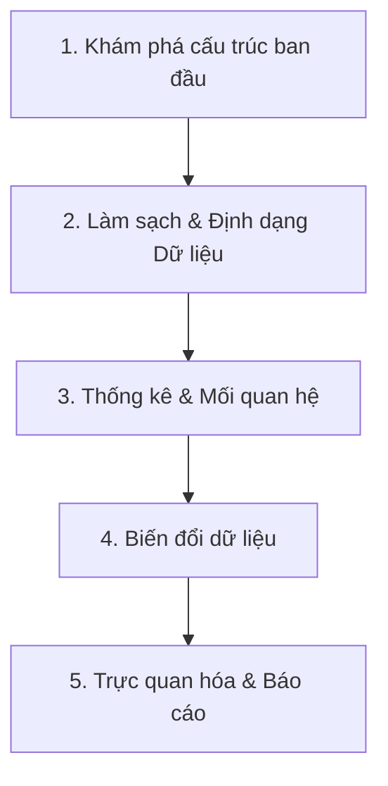

# Quy trình Khám phá Dữ liệu (EDA) Truyền thống
**Mục tiêu:** Giúp các thành viên trong dự án (đặc biệt là lập trình viên) nắm bắt chi tiết các bước nền tảng mà một Data Analyst/Scientist thường làm bằng tay. Tài liệu này đi sâu vào giải thích "Vì sao phải làm vậy" và "Có những cách nào để giải quyết", giúp team hình dung được độ phức tạp thực tế của quá trình xử lý dữ liệu.

---

## Tổng quan 5 Bước Cơ Bản Của EDA Truyền Thống

Quy trình chuẩn thường được thực hiện tuần tự qua 5 giai đoạn:

---

### Bước 1: Khám phá cấu trúc ban đầu (Initial Inspection)
*   **Tại sao phải làm bước này?** 
    Trước khi giải bài toán, ta phải biết mình đang có những dữ kiện gì. Việc khám phá ban đầu giống như việc "nhìn lướt qua" một căn nhà trước khi bắt tay vào dọn dẹp. Nó giúp ta định hình quy mô dữ liệu, biết được cột nào lưu chữ, cột nào lưu số, để từ đó lên kế hoạch áp dụng các thuật toán phù hợp (thuật toán cho chữ sẽ khác thuật toán cho số).
*   **Các tác vụ chi tiết:**
    *   **Đo lường kích thước:** Xem tập dữ liệu có bao nhiêu dòng (rows) và bao nhiêu cột (columns).
    *   **Xem trước dữ liệu (Preview):** Đọc 5-10 dòng đầu/cuối để có cảm nhận trực quan xem dữ liệu trông như thế nào (Ví dụ: cột "Ngày sinh" đang ghi theo kiểu `DD/MM/YYYY` hay `YYYY-MM-DD`).
    *   **Phân loại kiểu dữ liệu (Data types):** Máy tính cần biết rõ từng cột thuộc kiểu gì. Ta cần phân loại: Đâu là biến phân loại/chữ (Ví dụ: Giới tính, Quê quán), đâu là biến số lượng (Ví dụ: Tuổi, Mức lương), đâu là biến thời gian.

---

### Bước 2: Làm sạch & Định dạng Dữ liệu (Data Cleaning & Formatting)
*   **Tại sao phải làm bước này?** 
    Nguyên tắc tối thượng trong Data Science là *"Garbage in, garbage out"* (Rác vào thì rác ra). Dữ liệu thu thập ngoài đời thực luôn luôn bị dơ (người dùng nhập thiếu, hệ thống lỗi sinh ra dữ liệu âm...). Nếu không làm sạch, các thuật toán ở bước sau sẽ tính toán sai hoàn toàn, dẫn đến kết luận bị lệch lạc.
*   **Các tác vụ và phương pháp phổ biến:**
    *   **Xử lý dữ liệu thiếu (Missing values):** Dữ liệu bị trống là chuyện thường ngày. Có 3 hướng giải quyết thông dụng:
        1. *Xóa bỏ (Deletion):* Chỉ dùng khi tỷ lệ thiếu rất nhỏ (ví dụ < 5%). Nếu thiếu quá nhiều mà xóa thì sẽ mất đi thông tin quý giá của tập dữ liệu.
        2. *Điền khuyết bằng thống kê cơ bản (Statistical Imputation):* 
           - **Mean (Trung bình):** Dùng khi dữ liệu phân bố đều, không có giá trị quá lớn/quá nhỏ.
           - **Median (Trung vị):** Dùng khi dữ liệu bị lệch (Ví dụ: Lương của đa số là 10 triệu, tự dưng có người 1 tỷ. Điền Mean sẽ bị sai số lớn, lúc này phải dùng Median).
           - **Mode (Giá trị xuất hiện nhiều nhất):** Dùng cho biến chữ/phân loại (Ví dụ: Đa số khách hàng ở Hà Nội thì ô quê quán bị trống ta sẽ điền tạm là Hà Nội).
        3. *Điền khuyết bằng thuật toán (Advanced Imputation):* Dùng thuật toán (như KNN - tìm những người có đặc điểm giống nhất) để nội suy ra giá trị thiếu. Dùng khi dữ liệu cực kỳ quan trọng và không thể điền bừa.
    *   **Xử lý dữ liệu trùng lặp (Duplicates):** 
        - Trùng lặp hoàn toàn (tất cả các cột đều giống nhau) thì thường bị xóa. Trùng lặp một phần (Ví dụ: Cùng một mã giao dịch nhưng khác trạng thái) thì phải xem lại logic nghiệp vụ để quyết định giữ dòng nào.
    *   **Định dạng lại (Formatting):** 
        - Xử lý các lỗi đánh máy, khoảng trắng thừa, viết hoa/viết thường lộn xộn (Ví dụ: "Hà Nội", "hà nội", " HN" phải được quy về một chuẩn). Ép kiểu cho đúng (Ví dụ cột Tiền đang chứa ký tự "$" thì phải cắt bỏ "$" để biến thành số học).
    *   **Xử lý giá trị ngoại lệ (Outliers):** 
        - Ngoại lệ là những con số khác thường (Tuổi = 200, Lương = -5000). Thường được phát hiện qua 2 phương pháp: **Z-score** (dùng cho dữ liệu phân phối chuẩn) hoặc **IQR** (dùng cho dữ liệu bất kỳ).
        - Khi phát hiện ra, có thể chọn cách: Xóa bỏ (nếu chắc chắn là lỗi nhập liệu), Chặn giới hạn (Capping - ví dụ ai lớn hơn 80 tuổi đều gom chung là 80), hoặc Giữ nguyên (nếu đó là trường hợp đột biến có thật cần nghiên cứu, ví dụ giao dịch gian lận).

---

### Bước 3: Phân tích Thống kê & Mối quan hệ (Statistical Analysis)
*   **Tại sao phải làm bước này?** 
    Ở bước 1 và 2, ta mới chỉ nhìn "vỏ ngoài" của dữ liệu. Bước 3 dùng lăng kính toán học để "chụp X-quang" bên trong. Nó giúp ta hiểu được dữ liệu đang tập trung ở đâu, phân tán như thế nào, và đặc biệt là phát hiện ra "quy luật ngầm" giữa các yếu tố (Ví dụ: Có phải cứ chạy quảng cáo nhiều thì doanh thu sẽ tăng?).
*   **Các tác vụ và phương pháp phổ biến:**
    *   **Phân tích từng cột độc lập (Univariate Analysis):** Khám phá nội tại của một biến duy nhất.
        - *Xu hướng tập trung:* Tính Mean, Median, Mode để biết đa số dữ liệu đang nằm ở ngưỡng nào.
        - *Độ phân phân tán:* Tính Variance (Phương sai), Standard Deviation (Độ lệch chuẩn) để xem các số liệu có bị dao động, chênh lệch quá nhiều so với mức trung bình hay không.
        - *Hình dáng:* Tính Skewness (Độ xiên) để xem dữ liệu bị lệch trái hay phải.
    *   **Phân tích hai hay nhiều cột (Bivariate/Multivariate Analysis):** So sánh để tìm mối tương quan.
        - *Hai cột số với nhau:* Dùng Hệ số tương quan (Pearson hoặc Spearman Correlation) để xem chúng đồng biến hay nghịch biến (Biến A tăng thì B tăng hay giảm).
        - *Cột phân loại và cột số:* (Ví dụ: Giới tính và Lương) Dùng các bài test thống kê (như ANOVA, T-test) để xem Lương của nam và nữ có thực sự khác biệt hay không.

---

### Bước 4: Chuyển đổi Dữ liệu (Data Transformation)
*   **Tại sao phải làm bước này?** 
    Máy tính và các thuật toán học máy rất "ngu ngốc" với chữ viết và rất nhạy cảm với các con số quá lớn. Nếu để nguyên dữ liệu mà đưa cho AI phân tích, mô hình sẽ bị thiên lệch (bias) hoặc sập. Bước này là "nhai mớm" dữ liệu để máy tính dễ tiêu hóa nhất.
*   **Các tác vụ và phương pháp phổ biến:**
    *   **Chuẩn hóa (Scaling):** Đưa các cột về cùng một hệ quy chiếu. Ví dụ cột "Số con" chỉ từ 1-5, nhưng cột "Lương" lên tới hàng chục triệu. Nếu không chuẩn hóa, máy tính sẽ mặc định nghĩ cột Lương quan trọng hơn cột Số con hàng triệu lần.
        - *Min-Max Scaling:* Ép tất cả các số về khoảng từ 0 đến 1.
        - *Standard Scaler (Z-score):* Đưa dữ liệu về mức trung bình bằng 0.
        - *Robust Scaler:* Dùng khi dữ liệu có nhiều ngoại lệ (Outliers) mà ta không muốn xóa ở Bước 2.
    *   **Mã hóa (Encoding):** Biến chữ thành số.
        - *Label Encoding:* Dùng cho dữ liệu chữ có thứ bậc (Ví dụ: "Thấp", "Trung bình", "Cao" -> 0, 1, 2).
        - *One-Hot Encoding:* Dùng cho dữ liệu không có thứ bậc (Ví dụ: Xanh, Đỏ, Tím, Vàng). Thay vì biến thành 1,2,3,4 (máy tính sẽ hiểu lầm Vàng > Xanh), ta sẽ chẻ nó ra thành nhiều cột mới mang giá trị 0 hoặc 1.
    *   **Phân nhóm (Binning/Discretization):** Chia các giá trị liên tục thành các nhóm lớn (Ví dụ: Tuổi 22, 25, 29 gom chung thành "Thanh niên"). Việc này giúp giảm bớt sự phức tạp và nhiễu của dữ liệu.
    *   **Biến đổi hình dáng (Power Transforms):** Dùng hàm toán học (như Logarit) để nắn thẳng các cột dữ liệu bị lệch quá mức (Ví dụ cột Lương thường bị lệch phải rất nặng do có ít người siêu giàu), giúp các thuật toán hoạt động chính xác hơn.

---

### Bước 5: Trực quan hóa & Lập Báo cáo (Visualization & Reporting)
*   **Tại sao phải làm bước này?** 
    Con người rất kém trong việc đọc những bảng số liệu dài hàng triệu dòng, nhưng lại xử lý hình ảnh cực kỳ nhanh. Mục đích cuối cùng của EDA là "Giao tiếp" (Communication). Bạn phải vẽ hình để sếp hoặc khách hàng chỉ cần nhìn vào là nhận ra ngay vấn đề để đưa ra quyết định kinh doanh.
*   **Các tác vụ và phương pháp phổ biến:**
    *   **Lựa chọn biểu đồ phù hợp:** Sai lầm lớn nhất là vẽ sai biểu đồ.
        - *Muốn xem phân phối (1 biến số):* Dùng Histogram hoặc KDE Plot (để xem hình dáng đồi núi của dữ liệu).
        - *Muốn xem ngoại lệ và khoảng giá trị:* Dùng Boxplot hoặc Violin plot.
        - *Muốn xem quan hệ giữa 2 biến số:* Dùng Scatter plot (Biểu đồ phân tán).
        - *Muốn xem tổng quan ma trận tương quan:* Dùng Heatmap (Bản đồ nhiệt bằng màu sắc).
    *   **Rút ra kết luận (Insights):** Biểu đồ chỉ là công cụ, giá trị thực sự nằm ở những dòng nhận xét. (Ví dụ: "Nhìn vào biểu đồ Scatter plot, ta thấy rõ độ tuổi từ 25-30 có tỷ lệ chốt đơn cao nhất. Đề xuất tăng ngân sách marketing vào tệp này").
