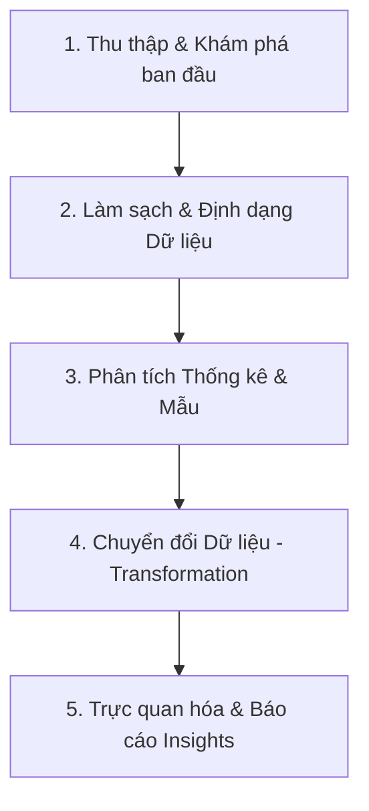

# Quy trình Phân tích Khám phá & Tiền xử lý Dữ liệu (EDA & Data Preprocessing) Chuẩn
**Nguồn tham khảo:** Khung quy chuẩn Data Science (CRISP-DM, IBM Data Science Workflow, và nguyên lý EDA của John Tukey).
**Mục tiêu:** Cung cấp quy trình truyền thống hệ thống hóa từ lúc nhận dữ liệu thô đến khi sẵn sàng cho mô hình hóa (Modeling) hoặc báo cáo (Reporting). (Quy trình thuần túy con người/truyền thống, không chứa yếu tố AI/LLM).

---

## Tổng quan luồng quy trình (Standard Workflow)

Trong thực tế, Phân tích khám phá (EDA) và Tiền xử lý dữ liệu (Data Preprocessing) là hai quá trình đan xen liên tục. Quy trình chuẩn được chia thành 5 giai đoạn cốt lõi:

---

## Chi tiết từng giai đoạn

### Giai đoạn 1: Khám phá cấu trúc dữ liệu ban đầu (Initial Data Inspection)
*   **Mục đích:** Hiểu được "hình dáng", ngữ cảnh của dữ liệu và nhận diện ban đầu về các vấn đề có thể xảy ra.
*   **Input:** Dữ liệu thô (Raw Data).
*   **Output:** Báo cáo cấu trúc tập dữ liệu và định hướng làm sạch.
*   **Các tác vụ chính:**
    *   Xem xét kích thước tập dữ liệu (số dòng, số cột).
    *   Xác định kiểu dữ liệu của từng trường (Integer, Float, String, Datetime).
    *   Phân loại biến: Biến mục tiêu (Target), biến số (Numeric), biến phân loại (Categorical).

### Giai đoạn 2: Làm sạch & Định dạng Dữ liệu (Data Cleaning & Formatting)
*   **Mục đích:** Giải quyết các dữ liệu nhiễu, lỗi, thiếu sót để đảm bảo tính toàn vẹn của dữ liệu (Data Integrity). "Garbage in, garbage out".
*   **Input:** Dữ liệu thô.
*   **Output:** Tập dữ liệu đã được làm sạch (Cleaned Dataset).
*   **Các tác vụ chính:**
    *   **Data Formatting (Định dạng dữ liệu):** Ép kiểu dữ liệu về đúng chuẩn (VD: Chuyển string "2023-01-01" thành object Datetime, chuẩn hóa chữ hoa/chữ thường, loại bỏ khoảng trắng thừa). Đảm bảo tính nhất quán của dữ liệu.
    *   **Handling Missing Values (Xử lý giá trị thiếu):** Đánh giá tỷ lệ Missing. Xóa dòng/cột nếu tỷ lệ quá cao, hoặc điền khuyết (Imputation) bằng Mean/Median/Mode hoặc các thuật toán nâng cao.
    *   **Handling Duplicates (Xử lý trùng lặp):** Loại bỏ các dòng lặp lại hoàn toàn để tránh thiên lệch (bias) trong kết quả.
    *   **Outlier Detection (Nhận diện ngoại lệ):** Tìm các giá trị vô lý do lỗi nhập liệu (dùng IQR hoặc Z-score) và quyết định giữ lại, cắt bỏ hoặc thay thế.

### Giai đoạn 3: Phân tích Thống kê & Khám phá Mẫu (Statistical Analysis & Pattern Discovery)
*   **Mục đích:** Khai thác sâu vào các đặc tính toán học của dữ liệu để tìm ra các xu hướng, sự phân bố và mối quan hệ giữa các biến.
*   **Input:** Tập dữ liệu đã làm sạch.
*   **Output:** Các chỉ số thống kê mô tả, ma trận tương quan.
*   **Các tác vụ chính:**
    *   **Phân tích Đơn biến (Univariate Analysis):** Tập trung vào TỪNG biến độc lập để xem phân phối (Distribution), khoảng giá trị (Range), độ lệch chuẩn (Standard Deviation), độ xiên (Skewness).
    *   **Phân tích Hai biến & Đa biến (Bivariate/Multivariate Analysis):** Phân tích mối quan hệ tương quan giữa các biến với nhau (Correlation) và quan hệ của chúng với Biến mục tiêu (Target).

### Giai đoạn 4: Chuyển đổi Dữ liệu (Data Transformation & Normalization)
*   **Mục đích:** Đưa dữ liệu về cùng một hệ quy chiếu và chuẩn bị định dạng tốt nhất cho các thuật toán Machine Learning hoặc các phép so sánh sâu hơn.
*   **Input:** Tập dữ liệu sạch & Các insight từ bước Thống kê.
*   **Output:** Tập dữ liệu đã sẵn sàng (Prepared Dataset).
*   **Các tác vụ chính:**
    *   **Normalization & Standardization (Chuẩn hóa/Bình thường hóa dữ liệu):** 
        *   *Min-Max Scaling (Normalization):* Đưa dữ liệu số về cùng thang đo [0, 1] để các cột có giá trị lớn (như Thu nhập) không lấn át các cột giá trị nhỏ (như Tuổi).
        *   *Z-score Scaling (Standardization):* Chuyển đổi để dữ liệu có trung bình (Mean) = 0 và độ lệch chuẩn (Std) = 1.
    *   **Data Binning (Rời rạc hóa):** Nhóm các giá trị liên tục thành các khoảng (VD: Tuổi từ 20-30 gộp thành nhóm "Thanh niên").
    *   **Categorical Encoding (Mã hóa phân loại):** Chuyển đổi dữ liệu chữ (Label) thành số (One-Hot Encoding, Label Encoding) để có thể tính toán được.

### Giai đoạn 5: Trực quan hóa & Báo cáo Insights (Visualization & Reporting)
*   **Mục đích:** Trình bày kết quả phân tích một cách trực quan, giúp các bên liên quan (Stakeholders) dễ dàng đưa ra quyết định kinh doanh.
*   **Input:** Các chỉ số thống kê và dữ liệu đã xử lý.
*   **Output:** Các Dashboard, Biểu đồ và Báo cáo (Report) đúc kết Insights.
*   **Các tác vụ chính:**
    *   Lựa chọn biểu đồ phù hợp: Bar chart (so sánh), Line chart (xu hướng), Scatter plot (tương quan), Heatmap (tổng quan ma trận).
    *   Tóm tắt các phát hiện quan trọng (Key Findings) thành văn bản nghiệp vụ do chuyên gia tự viết, trả lời các câu hỏi kinh doanh ban đầu định hướng cho dự án.
