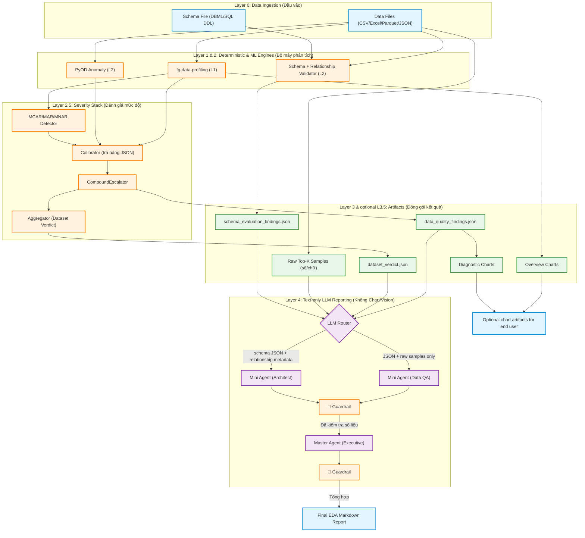

# Architecture & Implementation Plan: Smart EDA & Data Profiling

Tài liệu này đóng vai trò là **Bản thiết kế Kiến trúc Tổng thể** kết hợp **Kế hoạch Triển khai từng bước** cho dự án Smart EDA Report Tool. Mục tiêu của tài liệu là giúp bất kỳ thành viên mới nào (Developer, Data Scientist, hay Manager) khi đọc vào cũng hiểu rõ **Hệ thống hoạt động như thế nào (Flow)**, **Dùng công nghệ gì (What)**, và quan trọng nhất là **Tại sao lại chọn công nghệ đó (Why)**.

---

## 1. Tóm tắt Hệ thống (Executive Summary)
Dự án nhằm xây dựng một công cụ tự động hóa quy trình Khám phá Dữ liệu (EDA) và Đánh giá Chất lượng Dữ liệu (Data Quality).
Khác biệt hoàn toàn với các tool hiện có trên thị trường, hệ thống của chúng ta tuân thủ nguyên tắc **"Deterministic-First, LLM-Last"**:
- Máy tính (Python) sẽ dùng các công thức toán học và Machine Learning để tìm ra rác dữ liệu.
- AI (LLM) tuyệt đối không chạm vào dữ liệu thô. AI chỉ đóng vai trò "Người đọc kết quả thống kê" và "Viết báo cáo phân tích".
- Hệ thống Guardrail (Allowed-Set + Tolerance) sẽ chủ động quét mọi con số và tên cột trong văn bản LLM, đối chiếu với dữ liệu JSON gốc để chặn Hallucination.

## 2. Quyết định Chiến lược (Strategic Decisions)
1. **Hỗ trợ Đa luồng ngay từ v1.0:** Hệ thống không chỉ soi lỗi trên 1 bảng, mà còn đối chiếu chéo nhiều bảng với nhau dựa trên bản vẽ thiết kế (DBML/SQL DDL) hoặc bằng suy luận quan hệ từ dữ liệu khi schema thiếu FK. Đây là "vũ khí bí mật" giúp dự án vượt trội hơn các open-source hiện tại.
2. **Chiến lược Điều phối Mô hình AI (LLM Model Routing):** Tận dụng hệ sinh thái OpenAI. Dùng model dòng `Mini` (rẻ, nhanh, quỹ 2.5M tokens/ngày) cho các tác vụ vụn vặt. Dùng model `High-tier` (thông minh, quỹ 250k tokens/ngày) cho tác vụ tổng hợp cuối cùng.
3. **L4 không xử lý Chart:** Biểu đồ là artifact phụ trợ cho end user ở L3.5, không phải input/output của L4. L4 chỉ nhận dữ liệu thuần: JSON findings, raw samples dạng số/chữ, và schema/relationship metadata.

---

## 3. Sơ đồ Luồng Dữ liệu (System Data Flow)



---

## 3.1. Input/Output Contract theo từng Layer

| Layer | Input | Output | Ghi chú boundary |
| :--- | :--- | :--- | :--- |
| **L0 Ingestion** | File dữ liệu `.csv`, `.xlsx/.xls`, `.parquet`, `.json/.jsonl/.ndjson`; schema `.dbml` hoặc `.sql` tùy chọn | Một hoặc nhiều `pandas.DataFrame`; `UnifiedSchemaResult` gồm `tables`, `refs`, `meta` | Mọi format dữ liệu phải được chuẩn hóa thành DataFrame trước khi vào engine. |
| **L1 Profiling** | DataFrame từng bảng | `profile_result` dict từ `ydata-profiling/fg-data-profiling`: row/column count, missing, duplicate, type, numeric/categorical stats | CLI mặc định chạy profile đầy đủ hơn; test có thể bật `profiling_minimal=True` để chạy nhanh. |
| **L2 Anomaly + Schema** | DataFrame; schema result; danh sách bảng nếu multi-table | Outlier indices/scores; integrity errors; explicit/inferred table relationships | Khi thiếu FK hoặc tên cột lệch (`id_school` vs `trường học`), engine phải ghi alias/relationship inference cùng confidence/evidence. |
| **L2.5 Severity** | Findings thô từ L1/L2 | Severity per finding, `compound_severity`, dataset verdict READY/WARN/NOT_READY | `calibrator_table.json` v0.1 là heuristic, có DAMA mapping nhưng chưa được xem là scientific calibration hoàn chỉnh. |
| **L3 Ontology** | L1/L2/L2.5 outputs | `data_quality_findings.json`, `schema_evaluation_findings.json`, `dataset_verdict.json` | JSON phải chỉ rõ thiếu bảng/cột nào, alias nào được suy luận, quan hệ nào explicit/inferred, và tình trạng thiếu có chủ động hay không nếu có bằng chứng. |
| **L3.5 Visualization** | L3 JSON + DataFrame | Chart files tùy chọn cho end user | Không gửi chart vào L4. Chart không được dùng làm nguồn số liệu cho LLM. |
| **L4 Reporting** | Chỉ JSON + raw top-k samples dạng số/chữ | Markdown narrative đã qua guardrail | Không có Chart Architect, không Vision, không lệnh vẽ biểu đồ. LLM chỉ diễn giải số liệu đã có. |

---

## 4. Chi tiết Kiến trúc & Giải thích Lựa chọn Công nghệ

### Layer 1: Deterministic Profiling (Khám tổng quát)
**Nhiệm vụ:** Quét toàn bộ bảng dữ liệu để lấy các chỉ số bề mặt (có bao nhiêu dòng trống, kiểu dữ liệu là gì, giá trị trung bình...).
- **Công nghệ chọn:** `fg-data-profiling` (tên cũ: `ydata-profiling`, trước nữa là `pandas-profiling`).
- **Tại sao chọn?** Đây là thư viện mạnh nhất hiện nay cho việc này (hơn 13k stars Github). Tốc độ nhanh, tự động nhận diện kiểu dữ liệu cực tốt, và quan trọng nhất là có thể xuất toàn bộ thống kê ra 1 cục dictionary/JSON rất đầy đủ để ta dùng cho các bước sau.
- **Phát hiện Duplicate Rows:** Thư viện tự động đếm số dòng trùng lặp hoàn toàn (`n_duplicates`) và tỷ lệ % (`p_duplicates`). Ngoài ra, cảnh báo (Alerts) sẽ kích hoạt khi phát hiện >10 dòng trùng. Hệ thống sẽ trích xuất thông tin này vào JSON Spec và xuất danh sách các dòng bị trùng ra file CSV đính kèm để Data Engineer xử lý.
- **Phát hiện cảnh báo cột Categorical:** Thư viện tự động phát hiện các cột phân loại có vấn đề (High Cardinality, Imbalance, Constant values). Đây là tuyến phòng thủ chính cho dữ liệu dạng chữ ở v1.

### Layer 2: Khám chuyên sâu bằng AI truyền thống & Đối chiếu Lược đồ
**Nhiệm vụ 1: Tìm rác dữ liệu ở mức độ từng dòng (Anomaly Detection).**
- **Phạm vi v1:** Chỉ chạy PyOD trên các **cột số (Numeric)**. Các cột phân loại (Categorical) sẽ dựa vào cảnh báo của `fg-data-profiling` ở Layer 1.
- **Tiền xử lý ẩn:** Do PyOD không xử lý tốt NaN, hệ thống tạo một bản phân tích tạm chỉ gồm các cột numeric đủ điều kiện và loại các dòng NaN khỏi lượt quét anomaly. Dữ liệu gốc không bị sửa; missingness vẫn được báo cáo riêng ở L1/L2.5.
- **Hướng nâng cấp v2:** Encode cột Categorical (Label/Target Encoding) rồi ghép vào ma trận số để PyOD quét toàn bộ cả cột chữ lẫn cột số cùng lúc. Phương án này mạnh hơn vì phát hiện được rác đa biến giữa cột số và cột chữ (VD: "Giới tính = Nữ" nhưng "Nghĩa vụ quân sự = Đã hoàn thành"), tuy nhiên cần chọn đúng kỹ thuật Encoding cho từng loại cột để tránh LOF hoạt động sai lệch.
- **Công nghệ chọn:** `PyOD` với cơ chế **Ensemble (Hội đồng Giám khảo)** kết hợp 3 thuật toán: Isolation Forest, ECOD, và LOF (Local Outlier Factor).
- **Tại sao chọn 3 thuật toán?** Theo định lý "No Free Lunch", không có thuật toán nào đúng cho mọi loại data. Ta kết hợp cả 3:
  - *IForest:* Bắt rác tổng thể (Global anomalies).
  - *LOF:* Bắt rác cục bộ (Ví dụ: Lương 50 triệu là bình thường ở cty, nhưng là rác nếu nằm trong tệp Sinh viên thực tập).
  - *ECOD:* Chạy siêu tốc và trị được dữ liệu phân phối méo mó.
- **Cách kết hợp (Max Z-score + Threshold):** Hệ thống chuẩn hóa score từng thuật toán về z-score rồi lấy tín hiệu mạnh nhất. Cách này tránh làm loãng anomaly khi một thuật toán yếu hơn hoặc trả score lệch dấu trên dataset nhỏ.
- **Tính năng Data Export:** Tự động xuất (dump) toàn bộ 100% các dòng dữ liệu dị biệt ra file CSV riêng biệt đính kèm báo cáo để Data Engineer xử lý.

**Nhiệm vụ 2: Kiểm tra chéo giữa các bảng (Multi-table DBML).**
- **Công nghệ chọn:** `pydbml`, `simple-ddl-parser`, và code tự viết bằng `Pandas`.
- **Tại sao chọn?** Trên thế giới gần như chưa có Tool Open-Source nào xử lý tốt bài toán này. Ta đọc DBML/SQL DDL để hiểu khóa ngoại (Foreign Key) nối từ bảng A sang bảng B, sau đó dùng `Pandas` kiểm tra dữ liệu bị "mồ côi".
- **Khi schema thiếu FK:** Engine sẽ suy luận quan hệ 2 bảng bằng tên cột, tên bảng và độ phủ giá trị. Ví dụ nếu `students.id_school` có 100% giá trị nằm trong `schools.id` nhưng DBML chưa có `Ref`, JSON sẽ ghi `inferred_fk` với `status="missing_from_schema"`, `confidence`, và `evidence`.
- **Khi tên cột khác nhau nhưng cùng nghĩa:** Engine không được coi cứng là thiếu cột ngay. Ví dụ `id_school` và `trường học` được kiểm tra bằng normalization/alias heuristic; nếu đủ rõ, JSON ghi `COLUMN_ALIAS_INFERRED` kèm `candidate_aliases` để LLM/end user hiểu đây là một trường tương đương cần xác nhận.

### Layer 2.5: Severity Stack (Đánh giá mức độ nghiêm trọng)
**Nhiệm vụ:** Nhận kết quả thô từ L1 & L2, phân tích sâu hơn và gán mức độ nghiêm trọng trước khi đóng gói JSON.
- **Module (a) MCAR/MAR/MNAR Detector (~50 dòng):** Phân loại lý do thiếu dữ liệu (ngẫu nhiên / có hệ thống / tự thân). Dùng Little's test (`scipy`) + Logistic Regression. **Constraint Hiệu năng:** Do tính toán ma trận phức tạp, nếu dataset vượt quá 10.000 dòng, hệ thống bắt buộc lấy mẫu ngẫu nhiên (Random Stratified Sampling) xuống 10.000 dòng trước khi chạy để đảm bảo tốc độ phản hồi.
- **Module (b) Calibrator (~20 dòng runtime):** Tra bảng `calibrator_table.json` để gán severity. v0.1 dùng bảng đặt tay (Heuristics) và gắn nhãn DAMA; chưa được coi là căn cứ khoa học hoàn chỉnh. Trước production cần benchmark/calibration bằng dataset có nhãn hoặc tiêu chí business-risk rõ ràng.
- **Module (c) Aggregator (~30-50 dòng):** Tổng hợp lỗi toàn dataset → ra phán quyết READY / WARN / NOT_READY. Xuất `dataset_verdict.json`.
- **Module (d) CompoundEscalator (~15 dòng):** Nếu 1 cột dính nhiều lỗi → nâng `compound_severity` lên. Logic: `max(severity) + 1 bậc / lỗi thêm`, cap ở CRITICAL.

### Layer 3: Đóng gói Kết quả (Structured Findings Ontology)
**Nhiệm vụ:** Gom hết kết quả của L1, L2 và L2.5 lại thành ngôn ngữ chuẩn mực để đưa cho LLM đọc.
- **Quyết định 1: Tách 3 file JSON.** `data_quality_findings.json` (báo cáo rác), `schema_evaluation_findings.json` (báo cáo thiết kế), `dataset_verdict.json` (phán quyết tổng). *Lý do:* Tránh làm LLM bị "ngợp" (vượt quá Context Window).
- **Quyết định 2: Chuẩn hóa theo DAMA-DMBOK (C1).** Mọi lỗi đều được gán `dq_dimensions` chuẩn quốc tế (Completeness, Validity, Consistency, Timeliness, Uniqueness, Accuracy), kèm `ml_impact` và `compound_severity`.
- **Quyết định 3: Context cho thiếu bảng/cột.** `IntegrityError` có thể chứa `missing_field_context` để ghi rõ `expected_column`, `candidate_aliases`, `table_context`, `inferred_meaning`, và `is_intentional_missing`. Nếu hệ thống không có bằng chứng việc thiếu là chủ động, trường này phải là `null/unknown`, không đoán bừa.
- **Quyết định 4: Quan hệ bảng là first-class JSON.** `schema_evaluation_findings.json` có `relationships[]` để phân biệt `explicit_fk` và `inferred_fk`; mỗi quan hệ có `status`, `confidence`, và `evidence`.

### Layer 3.5: Hệ thống Biểu đồ Kép (Dual Visualization Engine)
**Nhiệm vụ:** Sinh biểu đồ minh họa.
- **Overview Charts:** Có thể trích xuất từ ydata hoặc tự vẽ ở Python để phục vụ người xem báo cáo.
- **Diagnostic Charts:** Nếu cần, Python vẽ biểu đồ chẩn đoán từ findings đã có. Chart là artifact phụ trợ cho end user, không phải input cho L4 và không được dùng làm bằng chứng số liệu cho LLM.

### Layer 4: Đội ngũ Báo cáo AI (Multi-Agent Orchestration)
**Nhiệm vụ:** Viết báo cáo Markdown hoàn chỉnh, sinh động, dễ hiểu.
- **Boundary bắt buộc:** L4 không có Chart Architect, không Vision, không trả lệnh vẽ biểu đồ. Input của L4 chỉ gồm JSON findings và raw top-k samples dạng số/chữ. Output của L4 là text/Markdown.
- **Tại sao dùng Multi-Agent?** Nếu ném 1 cục JSON khổng lồ cho LLM và bảo "Viết báo cáo đi", nó sẽ viết rất chung chung. Ta chia nhỏ ra theo cơ chế **Smart Routing & Batching**:
  - **Lọc bệnh (Severity Filtering):** Bỏ qua các lỗi nhẹ (INFO), chỉ gọi Mini Agent xử lý những lỗi từ WARN trở lên.
  - **Gộp nhóm (Issue-based Batching):** Gom theo nhóm lỗi (VD: 1 Agent chuyên lo giải quyết 5 cột bị lỗi Outlier) thay vì gọi từng Agent cho từng cột.
  - **Cắt ngọn (Top N Limit):** Tối đa chỉ cấp quyền cho AI phân tích sâu Top 5 cụm lỗi nghiêm trọng nhất. Các lỗi còn lại sẽ được Python tự động render thành bảng (Table) ở phần Phụ lục (Appendix) mà không tốn API call.
  
  **Các vai trò cụ thể:**
  - **Nhóm "Thợ" (Micro-Agents):** Dùng các model nhỏ (`gpt-4o-mini`). Mỗi thợ nhận 1 mảnh JSON đã được thái nhỏ theo cơ chế Batching ở trên và viết đoạn phân tích chi tiết.
  - **"Tổng biên tập" (Master Agent):** Dùng model xịn (`gpt-4o` hoặc `o1`). Đọc các mảnh ghép từ nhóm thợ, viết Executive Summary và Kết luận (Verdict).
- **Guardrail chống Hallucination (C3 — Allowed-Set + Tolerance + Column-Name Check):**
  - Một hàm Python đặt ngay sau đầu ra của MỖI Agent (cả Mini lẫn Master).
  - Xây dựng Allowed-Set: Thu thập tất cả số từ JSON gốc + Whitelist `{0,1,2,3,10,100,1000}` + Year pass-through.
  - Regex quét mọi số trong văn bản LLM → đối chiếu Allowed-Set với tolerance (integer: chính xác, decimal: ±0.0001, relative: ±0.1%).
  - Quét tên cột: Nếu LLM nhắc đến cột không tồn tại → Hallucination.
  - Vi phạm → Retry tối đa 3 lần. Nếu vẫn sai → thay bằng `<SỐ LIỆU CHƯA XÁC MINH>`.
- **Fallback hiện tại:** Khi L4 chưa triển khai, hệ thống vẫn xuất `summary_report.md` deterministic để end user đọc được verdict, lỗi chính, schema findings và quan hệ bảng mà không cần xem raw JSON.

---

## 5. Lộ trình Triển khai (Implementation Steps)

Để hiện thực hóa kiến trúc trên, dự án sẽ được code theo 4 giai đoạn:

### Phase 1: Xây dựng Bộ máy Cốt lõi (Core Engines - L1 & L2)
- `[ ]` Viết module `ingestion`: Code đọc file CSV, Excel, Parquet, JSON/JSONL và parse schema `.dbml/.sql`.
- `[ ]` Viết module `profiling_engine`: Tích hợp `ydata-profiling`.
- `[ ]` Viết module `anomaly_engine`: Tích hợp `PyOD` (Isolation Forest + ECOD + LOF Ensemble).
- `[ ]` Viết module `schema_engine`: Logic kiểm tra Khóa ngoại (Foreign Key), missing table/column, alias cột và quan hệ bảng inferred giữa các DataFrames.

### Phase 2: Chuẩn hóa Đầu ra + Severity Stack (L2.5 & L3)
- `[ ]` Định nghĩa Pydantic models với C1 fields (`dq_dimensions`, `ml_impact`, `compound_severity`, `confidence`) cho 3 file JSON.
- `[ ]` Viết module `severity/calibrator.py`: Tra bảng `calibrator_table.json` (đặt tay v0.1).
- `[ ]` Viết module `severity/missingness.py`: MCAR/MAR/MNAR detector.
- `[ ]` Viết module `severity/compound.py`: CompoundEscalator.
- `[ ]` Viết module `severity/aggregator.py`: Dataset Verdict (READY/WARN/NOT_READY).
- `[ ]` Viết module `findings_builder.py`: Gom L1 + L2 + L2.5 → xuất 3 file JSON chuẩn.

### Phase 3: Biểu đồ (Visualization - L3.5)
- `[ ]` Viết module `visualizer`: Hàm vẽ/trích xuất chart phục vụ end user.
- `[ ]` Đảm bảo chart không đi vào L4 và không được LLM dùng làm nguồn số liệu.

### Phase 4: Xây dựng Đội ngũ AI + Guardrail (L4)
- `[ ]` Viết module `guardrail/validator.py`: Allowed-Set builder, Regex extractor, tolerance matcher, column-name checker.
- `[ ]` Viết Prompt cho **Mini Agent (Data QA)** và **Mini Agent (Architect)** theo text-only contract.
- `[ ]` Viết Prompt cho **Master Agent** để tổng hợp ra file Markdown cuối cùng.
- `[ ]` Tích hợp Guardrail vào sau mỗi Agent call (Mini + Master).

### Phase 5: Tích hợp và Kiểm thử (Integration & Testing)
- `[ ]` Viết file `main.py` để nối toàn bộ pipeline từ L0 đến L4 chạy bằng 1 cú click.
- `[ ]` Chạy thử nghiệm trên dataset `Titanic` (Single-table) và một dataset E-commerce giả lập (Multi-table có DBML).
- `[ ]` Eval suite 50-finding: Đo hallucination rate, kill criterion > 2%.

---

## 6. Thiết kế Mã nguồn (Plugin/Modular Design)
Để đảm bảo dễ bảo trì và mở rộng, mã nguồn sẽ được chia thành các thư mục độc lập (Plugin-based):
```text
src/
├── ingestion/               # Các Plugin đọc dữ liệu (Output luôn là Pandas DataFrame)
│   ├── csv_reader.py
│   ├── readers.py           # CSV/Excel/Parquet/JSON readers
│   ├── registry.py          # load_any() auto-detect data format
│   └── schema_reader.py     # DBML/SQL DDL parser adapters
├── engines/                 # Core logic xử lý (L1 & L2)
│   ├── profiling_engine.py  # Wrap ydata-profiling (Layer 1)
│   ├── anomaly_engine.py    # Wrap PyOD (Layer 2)
│   ├── schema_engine.py     # Schema validation + relationship inference
│   └── visualizer.py        # Chart artifact cho end user, không thuộc L4
├── severity/                # Layer 2.5: Severity Stack (C2)
│   ├── calibrator.py        # Tra bảng calibrator_table.json
│   ├── missingness.py       # MCAR/MAR/MNAR detector
│   ├── compound.py          # CompoundEscalator
│   ├── aggregator.py        # Dataset Verdict (READY/WARN/NOT_READY)
│   └── calibrator_table.json  # Bảng ngưỡng đặt tay v0.1
├── ontology/                # Định nghĩa cấu trúc file JSON (Layer 3)
│   ├── models.py            # Pydantic models với C1 fields (DAMA, ml_impact, compound_severity)
│   ├── findings_builder.py  # Gom L1 + L2 + L2.5 → JSON chuẩn
│   └── exporters.py         # Xuất ra JSON/YAML
├── guardrail/               # Layer 4 Guardrail (C3)
│   ├── validator.py         # Allowed-Set builder + Regex + tolerance matcher
│   ├── column_checker.py    # Column-name hallucination check
│   └── policy.py            # Retry policy, tolerance config
└── reporting/               # Báo cáo text
    ├── summary_renderer.py  # Markdown deterministic fallback cho end user
    ├── prompts/             # Template cho L4 text-only Agents
    └── agents/              # Mini Agents, Master Agent
```

## 7. Kế hoạch Kiểm thử (Verification Plan)
- **Automated Tests:** Tạo thư mục `tests/` chứa các bộ dataset mẫu (1 sạch, 1 lỗi, 1 sai DBML). Viết unit tests để đảm bảo `anomaly_engine` bắt được dòng rác, và `schema_engine` bắt được lỗi mồ côi.
- **Manual Verification:** Build end-to-end pipeline chạy trên 1 terminal duy nhất. Output cuối cùng phải sinh ra 3 JSON chuẩn và `summary_report.md`; chart nếu có là artifact phụ trợ riêng, không phải phần bắt buộc của L4.

---

## 8. Giới hạn Hệ thống & Cơ chế Xử lý sự cố (System Limitations & Fallbacks)
Để hệ thống sẵn sàng cho môi trường Production thực tế, các yêu cầu phi chức năng (Non-Functional Requirements) sau đây được áp dụng:

### 8.1. Data Sampling Strategy (Chiến lược chống tràn RAM)
- **Vấn đề:** Các thuật toán ML ở Layer 2 và ydata-profiling ở Layer 1 sẽ gây lỗi Out of Memory (OOM) nếu nạp dataset quá lớn (Ví dụ: > 1GB, hàng chục triệu dòng).
- **Giải pháp:** Áp dụng cơ chế Smart Sampling (Lấy mẫu thông minh).
  - Khởi tạo giới hạn: Nếu dung lượng file < 500MB hoặc số dòng < 500,000 -> Quét toàn bộ.
  - Vượt quá giới hạn: Hệ thống sẽ tự động dùng Pandas Random Sampling lấy ra chính xác 500,000 dòng để phân tích. Việc này đảm bảo AI vẫn nhìn thấy pattern lỗi mà không làm cháy máy chủ.

### 8.2. LLM Fault Tolerance (Cơ chế chịu lỗi khi gọi AI)
- **Vấn đề:** OpenAI API có thể bị quá tải, timeout, hoặc model trả về định dạng rác (không tuân thủ cú pháp Markdown mong muốn).
- **Giải pháp:** 
  - Cơ chế Retry: Tự động gọi lại API tối đa 3 lần nếu có lỗi mạng.
  - Graceful Degradation (Suy thoái an toàn): Nếu sau 3 lần vẫn lỗi, hệ thống KHÔNG crash. Nó sẽ fallback về "Chế độ Cơ bản" -> Trả ra báo cáo Markdown deterministic từ JSON và raw top-k samples, tự động ẩn phần nhận xét của AI đi.

### 8.3. Ontology Contract (Đặc tả API)
- Để đảm bảo nhóm Mini Agents không bị loạn, cấu trúc JSON giữa L2 và L3 sẽ được quản lý khắt khe bằng Pydantic. Mọi chi tiết về Schema sẽ không nằm trong tài liệu này mà được đặc tả riêng tại `docs/schema_definitions.md` (Sẽ triển khai ở Phase 2).
