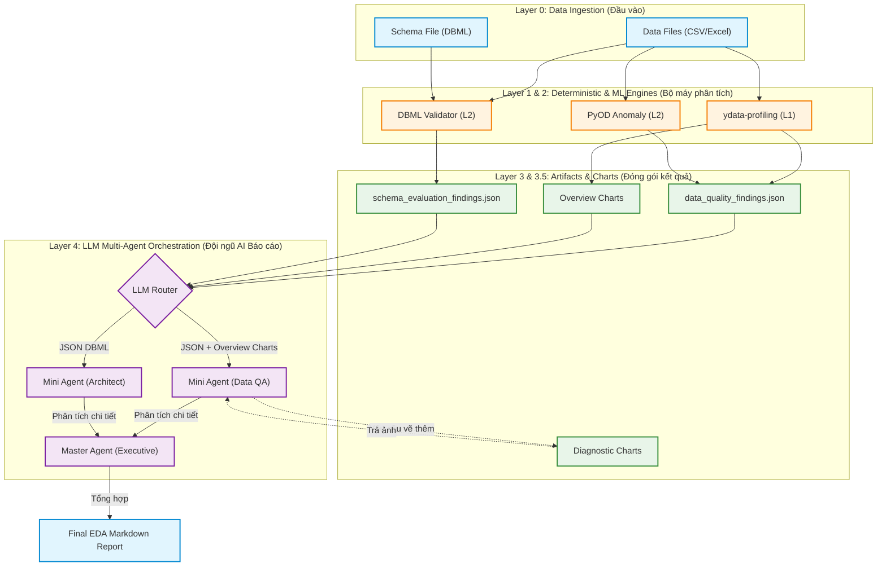

# Architecture & Implementation Plan: Smart EDA & Data Profiling

Tài liệu này đóng vai trò là **Bản thiết kế Kiến trúc Tổng thể** kết hợp **Kế hoạch Triển khai từng bước** cho dự án Smart EDA Report Tool. Mục tiêu của tài liệu là giúp bất kỳ thành viên mới nào (Developer, Data Scientist, hay Manager) khi đọc vào cũng hiểu rõ **Hệ thống hoạt động như thế nào (Flow)**, **Dùng công nghệ gì (What)**, và quan trọng nhất là **Tại sao lại chọn công nghệ đó (Why)**.

---

## 1. Tóm tắt Hệ thống (Executive Summary)
Dự án nhằm xây dựng một công cụ tự động hóa quy trình Khám phá Dữ liệu (EDA) và Đánh giá Chất lượng Dữ liệu (Data Quality).
Khác biệt hoàn toàn với các tool hiện có trên thị trường, hệ thống của chúng ta tuân thủ nguyên tắc **"Deterministic-First, LLM-Last"**:
- Máy tính (Python) sẽ dùng các công thức toán học và Machine Learning để tìm ra rác dữ liệu.
- AI (LLM) tuyệt đối không chạm vào dữ liệu thô. AI chỉ đóng vai trò "Người đọc kết quả thống kê" và "Viết báo cáo phân tích". Điều này loại bỏ 100% tỷ lệ AI bịa số liệu (Hallucination).

## 2. Quyết định Chiến lược (Strategic Decisions)
1. **Hỗ trợ Đa luồng ngay từ v1.0:** Hệ thống không chỉ soi lỗi trên 1 bảng (Single-table CSV), mà còn đối chiếu chéo nhiều bảng với nhau dựa trên bản vẽ thiết kế (DBML). Đây là "vũ khí bí mật" giúp dự án vượt trội hơn các open-source hiện tại.
2. **Chiến lược Điều phối Mô hình AI (LLM Model Routing):** Tận dụng hệ sinh thái OpenAI. Dùng model dòng `Mini` (rẻ, nhanh, quỹ 2.5M tokens/ngày) cho các tác vụ vụn vặt. Dùng model `High-tier` (thông minh, quỹ 250k tokens/ngày) cho tác vụ tổng hợp cuối cùng.
3. **Biểu đồ Kép (Dual Visualization):** Kết hợp giữa Biểu đồ tổng quan (Luôn vẽ) và Biểu đồ chẩn đoán (Chỉ vẽ khi có lỗi, do AI ra lệnh).

---

## 3. Sơ đồ Luồng Dữ liệu (System Data Flow)



---

## 4. Chi tiết Kiến trúc & Giải thích Lựa chọn Công nghệ

### Layer 1: Deterministic Profiling (Khám tổng quát)
**Nhiệm vụ:** Quét toàn bộ bảng dữ liệu để lấy các chỉ số bề mặt (có bao nhiêu dòng trống, kiểu dữ liệu là gì, giá trị trung bình...).
- **Công nghệ chọn:** `fg-data-profiling` (tên cũ: `ydata-profiling`, trước nữa là `pandas-profiling`).
- **Tại sao chọn?** Đây là thư viện mạnh nhất hiện nay cho việc này (hơn 13k stars Github). Tốc độ nhanh, tự động nhận diện kiểu dữ liệu cực tốt, và quan trọng nhất là có thể xuất toàn bộ thống kê ra 1 cục dictionary/JSON rất đầy đủ để ta dùng cho các bước sau.
- **Phát hiện Duplicate Rows:** Thư viện tự động đếm số dòng trùng lặp hoàn toàn (`n_duplicates`) và tỷ lệ % (`p_duplicates`). Ngoài ra, cảnh báo (Alerts) sẽ kích hoạt khi phát hiện >10 dòng trùng. Hệ thống sẽ trích xuất thông tin này vào JSON Spec và xuất danh sách các dòng bị trùng ra file CSV đính kèm để Data Engineer xử lý.
- **Phát hiện cảnh báo cột Categorical:** Thư viện tự động phát hiện các cột phân loại có vấn đề (High Cardinality, Imbalance, Constant values). Đây là tuyến phòng thủ chính cho dữ liệu dạng chữ ở v1.

### Layer 2: Khám chuyên sâu bằng AI truyền thống & Đối chiếu Lược đồ
**Nhiệm vụ 1: Tìm rác dữ liệu ở mức độ từng dòng (Anomaly Detection).**
- **Phạm vi v1:** Chỉ chạy PyOD trên các **cột số (Numeric)**. Các cột phân loại (Categorical) sẽ dựa vào cảnh báo của `fg-data-profiling` ở Layer 1.
- **Hướng nâng cấp v2:** Encode cột Categorical (Label/Target Encoding) rồi ghép vào ma trận số để PyOD quét toàn bộ cả cột chữ lẫn cột số cùng lúc. Phương án này mạnh hơn vì phát hiện được rác đa biến giữa cột số và cột chữ (VD: "Giới tính = Nữ" nhưng "Nghĩa vụ quân sự = Đã hoàn thành"), tuy nhiên cần chọn đúng kỹ thuật Encoding cho từng loại cột để tránh LOF hoạt động sai lệch.
- **Công nghệ chọn:** `PyOD` với cơ chế **Ensemble (Hội đồng Giám khảo)** kết hợp 3 thuật toán: Isolation Forest, ECOD, và LOF (Local Outlier Factor).
- **Tại sao chọn 3 thuật toán?** Theo định lý "No Free Lunch", không có thuật toán nào đúng cho mọi loại data. Ta kết hợp cả 3:
  - *IForest:* Bắt rác tổng thể (Global anomalies).
  - *LOF:* Bắt rác cục bộ (Ví dụ: Lương 50 triệu là bình thường ở cty, nhưng là rác nếu nằm trong tệp Sinh viên thực tập).
  - *ECOD:* Chạy siêu tốc và trị được dữ liệu phân phối méo mó.
- **Cách kết hợp (Average Score + Threshold):** Hệ thống dùng `pyod.models.combination.average()` để lấy điểm trung bình của 3 thuật toán. Dòng nào có điểm trung bình vượt ngưỡng (threshold) sẽ bị đánh dấu là rác. Cách này được khuyến nghị bởi benchmark ADBench (NeurIPS 2022) vì linh hoạt và chính xác hơn so với hard voting.
- **Tính năng Data Export:** Tự động xuất (dump) toàn bộ 100% các dòng dữ liệu dị biệt ra file CSV riêng biệt đính kèm báo cáo để Data Engineer xử lý.

**Nhiệm vụ 2: Kiểm tra chéo giữa các bảng (Multi-table DBML).**
- **Công nghệ chọn:** Thư viện `pydbml` kết hợp code tự viết bằng `Pandas`.
- **Tại sao chọn?** Trên thế giới gần như chưa có Tool Open-Source nào xử lý được bài toán này. Ta dùng `pydbml` để đọc file thiết kế, hiểu được khóa ngoại (Foreign Key) nối từ bảng A sang bảng B. Sau đó dùng `Pandas` quét file CSV để kiểm tra xem có dòng dữ liệu nào bị "mồ côi" không. 

### Layer 3: Đóng gói Kết quả (Structured Findings Ontology)
**Nhiệm vụ:** Gom hết kết quả của L1 và L2 lại thành một ngôn ngữ chuẩn mực để đưa cho LLM đọc.
- **Quyết định 1: Tách 2 file JSON.** Chúng ta tách `data_quality_findings.json` (báo cáo rác dữ liệu) và `schema_evaluation_findings.json` (báo cáo thiết kế hệ thống). *Lý do:* Tránh làm LLM bị "ngợp" (vượt quá Context Window), gây ra bệnh nhớ trước quên sau.
- **Quyết định 2: Chuẩn hóa theo DAMA-DMBOK.** Mọi lỗi rác dữ liệu đều phải được gán mác chuẩn quốc tế (Lỗi do Completeness, hay do Validity...) chứ không được liệt kê bừa bãi.

### Layer 3.5: Hệ thống Biểu đồ Kép (Dual Visualization Engine)
**Nhiệm vụ:** Sinh biểu đồ minh họa.
- **Overview Charts (Trích xuất từ ydata):** Không "phát minh lại cái bánh xe" bằng cách tự code vẽ. Ta sẽ làm thao tác **Trích xuất (Extract)** các biểu đồ tuyệt đẹp đã được vẽ sẵn nằm trong bụng output của `ydata-profiling` để dùng luôn.
- **Diagnostic Charts (LLM-Directed):** Ở Layer 4, nếu con LLM thấy cột "Tuổi" có rác quá nặng, nó sẽ trả về lệnh JSON yêu cầu: "Vẽ ngay cho tao cái scatter plot của cột Tuổi". Code ở Layer 3.5 sẽ nhận lệnh, dùng Python tự vẽ biểu đồ, trong đó bôi đỏ toàn bộ 100% các điểm rác đè lên dữ liệu thường để minh họa. Sau đó gửi link ảnh lại cho LLM.

### Layer 4: Đội ngũ Báo cáo AI (Multi-Agent Orchestration)
**Nhiệm vụ:** Viết báo cáo Markdown hoàn chỉnh, sinh động, dễ hiểu.
- **Tại sao dùng Multi-Agent?** Nếu ném 1 cục JSON khổng lồ cho LLM và bảo "Viết báo cáo đi", nó sẽ viết rất chung chung. Ta chia nhỏ ra:
  - **Nhóm "Thợ" (Micro-Agents):** Dùng các model nhỏ (`gpt-4o-mini`). Mỗi thợ chỉ nhìn vào 1 biểu đồ hoặc 1 bảng JSON nhỏ xíu, và viết 1 đoạn nhận xét vài câu. Cực kỳ nhanh, giá rẻ, độ chi tiết siêu cao.
  - **"Tổng biên tập" (Master Agent):** Dùng model xịn (`gpt-4o` hoặc `o1`). Đọc các mảnh ghép từ nhóm thợ, viết thêm đoạn Mở bài (Executive Summary) và chắp vá lại thành 1 báo cáo Markdown tuyệt đẹp.

---

## 5. Lộ trình Triển khai (Implementation Steps)

Để hiện thực hóa kiến trúc trên, dự án sẽ được code theo 4 giai đoạn:

### Phase 1: Xây dựng Bộ máy Cốt lõi (Core Engines - L1 & L2)
- `[ ]` Viết module `ingestion`: Code đọc file CSV, Excel và parse file `.dbml`.
- `[ ]` Viết module `profiling_engine`: Tích hợp `ydata-profiling`.
- `[ ]` Viết module `anomaly_engine`: Tích hợp `PyOD` (Isolation Forest).
- `[ ]` Viết module `schema_engine`: Logic kiểm tra Khóa ngoại (Foreign Key) giữa các DataFrames.

### Phase 2: Chuẩn hóa Đầu ra (Ontology & Artifacts - L3 & L3.5)
- `[ ]` Định nghĩa cấu trúc chuẩn (Pydantic models) cho 2 file JSON (`data_quality` và `schema`).
- `[ ]` Viết module `visualizer`: Hàm vẽ Overview Charts.
- `[ ]` Liên kết dữ liệu từ Phase 1 để xuất thành công ra 2 file JSON chuẩn.

### Phase 3: Xây dựng Đội ngũ AI (AI Orchestration - L4)
- `[ ]` Cài đặt thư viện gọi API OpenAI (`openai` python client).
- `[ ]` Viết Prompt cho **Mini Agent (Data QA)** và **Mini Agent (Architect)**. Xử lý logic đọc JSON từng phần.
- `[ ]` Cài đặt tính năng **LLM-Directed Visualization**: Parse lệnh yêu cầu vẽ biểu đồ từ Agent và gọi lại `visualizer`.
- `[ ]` Viết Prompt cho **Master Agent** để tổng hợp ra file Markdown cuối cùng.

### Phase 4: Tích hợp và Kiểm thử (Integration & Testing)
- `[ ]` Viết file `main.py` để nối toàn bộ pipeline từ L0 đến L4 chạy bằng 1 cú click.
- `[ ]` Chạy thử nghiệm trên dataset `Titanic` (Single-table) và một dataset E-commerce giả lập (Multi-table có DBML).
- `[ ]` Tinh chỉnh prompt để biểu đồ hiển thị đẹp mắt trong file Markdown.

---

## 6. Thiết kế Mã nguồn (Plugin/Modular Design)
Để đảm bảo dễ bảo trì và mở rộng, mã nguồn sẽ được chia thành các thư mục độc lập (Plugin-based):
```text
src/
├── ingestion/               # Các Plugin đọc dữ liệu (Output luôn là Pandas DataFrame)
│   ├── csv_reader.py
│   ├── excel_reader.py
│   └── dbml_parser.py       # Dùng pydbml
├── engines/                 # Core logic xử lý
│   ├── profiling_engine.py  # Wrap ydata-profiling (Layer 1)
│   ├── anomaly_engine.py    # Wrap PyOD (Layer 2)
│   └── schema_engine.py     # Đối chiếu DataFrame vs DBML (Layer 2)
├── ontology/                # Định nghĩa cấu trúc file JSON (Layer 3)
│   ├── findings_builder.py  # Gom kết quả thành chuẩn DAMA/ISO
│   └── exporters.py         # Xuất ra JSON/YAML
└── reporting/               # Lớp LLM (Layer 4)
    ├── visualizer.py        # Vẽ biểu đồ (Overview & Diagnostic)
    ├── prompts/             # Template cho các AI Agents
    └── agents/              # Chứa logic của Mini Agents và Master Agent
```

## 7. Kế hoạch Kiểm thử (Verification Plan)
- **Automated Tests:** Tạo thư mục `tests/` chứa các bộ dataset mẫu (1 sạch, 1 lỗi, 1 sai DBML). Viết unit tests để đảm bảo `anomaly_engine` bắt được dòng rác, và `schema_engine` bắt được lỗi mồ côi.
- **Manual Verification:** Build end-to-end pipeline chạy trên 1 terminal duy nhất. Output cuối cùng phải sinh ra 1 file Markdown có chèn ảnh biểu đồ đầy đủ, kèm nhận xét chuyên sâu từ LLM.

---

## 8. Giới hạn Hệ thống & Cơ chế Xử lý sự cố (System Limitations & Fallbacks)
Để hệ thống sẵn sàng cho môi trường Production thực tế, các yêu cầu phi chức năng (Non-Functional Requirements) sau đây được áp dụng:

### 8.1. Data Sampling Strategy (Chiến lược chống tràn RAM)
- **Vấn đề:** Các thuật toán ML ở Layer 2 và ydata-profiling ở Layer 1 sẽ gây lỗi Out of Memory (OOM) nếu nạp dataset quá lớn (Ví dụ: > 1GB, hàng chục triệu dòng).
- **Giải pháp:** Áp dụng cơ chế Smart Sampling (Lấy mẫu thông minh).
  - Khởi tạo giới hạn: Nếu dung lượng file < 500MB hoặc số dòng < 500,000 -> Quét toàn bộ.
  - Vượt quá giới hạn: Hệ thống sẽ tự động dùng Pandas Random Sampling lấy ra chính xác 500,000 dòng để phân tích. Việc này đảm bảo AI vẫn nhìn thấy pattern lỗi mà không làm cháy máy chủ.

### 8.2. LLM Fault Tolerance (Cơ chế chịu lỗi khi gọi AI)
- **Vấn đề:** OpenAI API có thể bị quá tải, timeout, hoặc model trả về định dạng rác (không tuân thủ cú pháp Markdown mong muốn).
- **Giải pháp:** 
  - Cơ chế Retry: Tự động gọi lại API tối đa 3 lần nếu có lỗi mạng.
  - Graceful Degradation (Suy thoái an toàn): Nếu sau 3 lần vẫn lỗi, hệ thống KHÔNG crash. Nó sẽ fallback về "Chế độ Cơ bản" -> Trả ra báo cáo Markdown chỉ chứa biểu đồ và dữ liệu thống kê từ Layer 1 & 2, tự động ẩn phần nhận xét của AI đi.

### 8.3. Ontology Contract (Đặc tả API)
- Để đảm bảo nhóm Mini Agents không bị loạn, cấu trúc JSON giữa L2 và L3 sẽ được quản lý khắt khe bằng Pydantic. Mọi chi tiết về Schema sẽ không nằm trong tài liệu này mà được đặc tả riêng tại `docs/schema_definitions.md` (Sẽ triển khai ở Phase 2).
