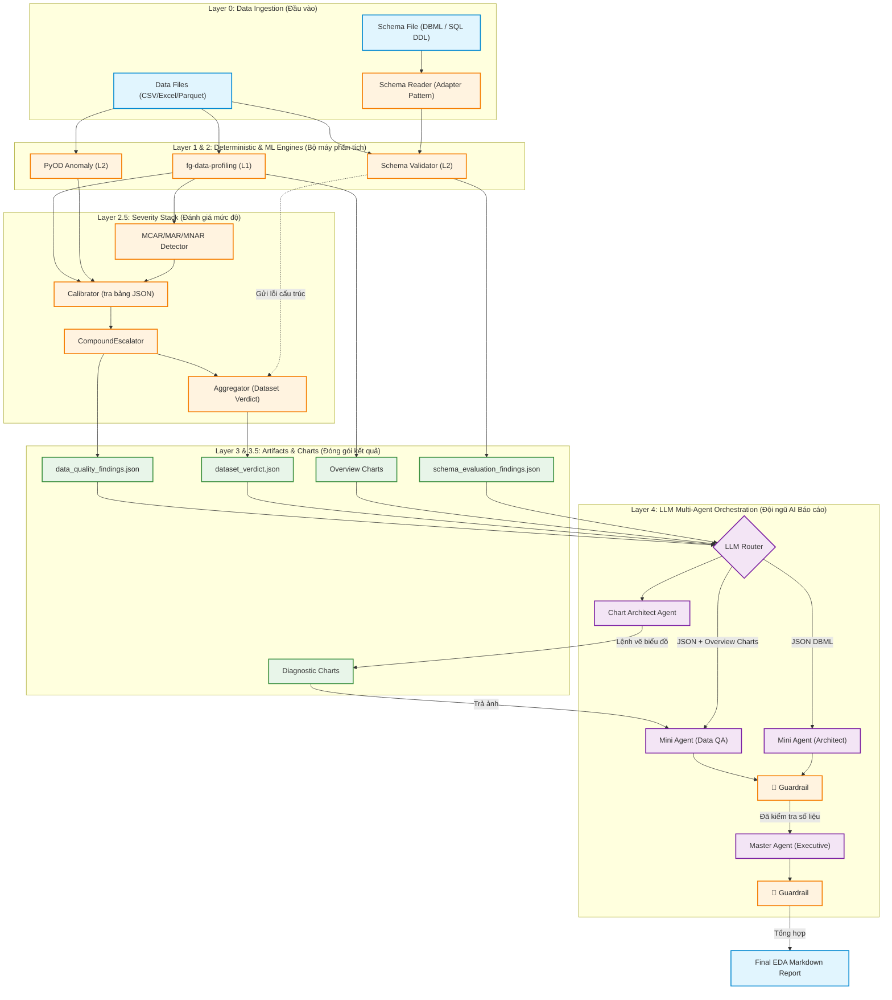

# Architecture & Implementation Plan: Smart EDA & Data Profiling

Tài liệu này đóng vai trò là **Bản thiết kế Kiến trúc Tổng thể** kết hợp **Kế hoạch Triển khai từng bước** cho dự án Smart EDA Report Tool. Mục tiêu của tài liệu là giúp bất kỳ thành viên mới nào (Developer, Data Scientist, hay Manager) khi đọc vào cũng hiểu rõ **Hệ thống hoạt động như thế nào (Flow)**, **Dùng công nghệ gì (What)**, và quan trọng nhất là **Tại sao lại chọn công nghệ đó (Why)**.

---

## 1. Tóm tắt Hệ thống (Executive Summary)
Dự án nhằm xây dựng một công cụ tự động hóa quy trình Khám phá Dữ liệu (EDA) và Đánh giá Chất lượng Dữ liệu (Data Quality).
Khác biệt hoàn toàn với các tool hiện có trên thị trường, hệ thống của chúng ta tuân thủ nguyên tắc **"Deterministic-First, LLM-Last"**:
- Máy tính (Python) sẽ dùng các công thức toán học và Machine Learning để tìm ra rác dữ liệu.
- AI (LLM) tuyệt đối không chạm vào dữ liệu thô. AI chỉ đóng vai trò "Người đọc kết quả thống kê" và "Viết báo cáo phân tích".
- Hệ thống Guardrail (Allowed-Set + Tolerance) sẽ chủ động quét mọi con số và tên cột trong văn bản LLM, đối chiếu với dữ liệu JSON gốc để chặn Hallucination.

## 2. Quyết định Chiến lược (Strategic Decisions)
1. **Hỗ trợ Đa luồng ngay từ v1.0:** Hệ thống không chỉ soi lỗi trên 1 bảng (Single-table CSV), mà còn đối chiếu chéo nhiều bảng với nhau dựa trên bản vẽ thiết kế database (DBML hoặc SQL DDL). Đây là "vũ khí bí mật" giúp dự án vượt trội hơn các open-source hiện tại.
2. **Chiến lược Điều phối Mô hình AI (LLM Model Routing):** Tận dụng hệ sinh thái OpenAI. Dùng model dòng `Mini` (rẻ, nhanh, quỹ 2.5M tokens/ngày) cho các tác vụ vụn vặt. Dùng model `High-tier` (thông minh, quỹ 250k tokens/ngày) cho tác vụ tổng hợp cuối cùng.
3. **Biểu đồ Kép (Dual Visualization):** Kết hợp giữa Biểu đồ tổng quan (Luôn vẽ) và Biểu đồ chẩn đoán (Chỉ vẽ khi có lỗi, do AI ra lệnh).

---

## 3. Sơ đồ Luồng Dữ liệu (System Data Flow)



---

## 4. Chi tiết Kiến trúc & Giải thích Lựa chọn Công nghệ

### Layer 1: Deterministic Profiling (Khám tổng quát)
**Nhiệm vụ:** Quét toàn bộ bảng dữ liệu để lấy các chỉ số bề mặt (có bao nhiêu dòng trống, kiểu dữ liệu là gì, giá trị trung bình...).
- **Công nghệ chọn:** `fg-data-profiling` (tên cũ: `ydata-profiling`, trước nữa là `pandas-profiling`).
- **Tại sao chọn?** Đây là thư viện mạnh nhất hiện nay cho việc này (hơn 13k stars Github). Tốc độ nhanh, tự động nhận diện kiểu dữ liệu cực tốt, và quan trọng nhất là có thể xuất toàn bộ thống kê ra 1 cục dictionary/JSON rất đầy đủ để ta dùng cho các bước sau.
- **Phát hiện Duplicate Rows:** Thư viện tự động đếm số dòng trùng lặp hoàn toàn (`n_duplicates`) và tỷ lệ % (`p_duplicates`). Ngoài ra, cảnh báo (Alerts) sẽ kích hoạt khi phát hiện >10 dòng trùng. Hệ thống sẽ trích xuất thông tin này vào JSON Spec và xuất danh sách các dòng bị trùng ra file CSV đính kèm để Data Engineer xử lý.
- **Phát hiện cảnh báo cột Categorical:** Thư viện tự động phát hiện các cột phân loại có vấn đề (High Cardinality, Imbalance, Constant values). Đây là tuyến phòng thủ chính cho dữ liệu dạng chữ ở v1.

### Layer 2: Khám chuyên sâu bằng AI truyền thống & Đối chiếu Lược đồ
**Nhiệm vụ 1: Tìm rác dữ liệu ở mức độ từng dòng (Anomaly Detection).**
- **Phạm vi v1:** Chỉ chạy PyOD trên các **cột số (Numeric)**. Các cột phân loại (Categorical) sẽ dựa vào cảnh báo của `fg-data-profiling` ở Layer 1.
- **Tiền xử lý ẩn (Pre-imputation):** Do các thuật toán PyOD sẽ bị crash (báo lỗi) nếu gặp dữ liệu trống (NaN), hệ thống phải tự động tạo một bản copy của dữ liệu và điền khuyết bằng `Median` trước khi đưa vào PyOD quét. Bản copy này sau đó bị hủy, dữ liệu gốc vẫn giữ nguyên lỗ hổng để báo cáo.
- **Hướng nâng cấp v2:** Encode cột Categorical (Label/Target Encoding) rồi ghép vào ma trận số để PyOD quét toàn bộ cả cột chữ lẫn cột số cùng lúc. Phương án này mạnh hơn vì phát hiện được rác đa biến giữa cột số và cột chữ (VD: "Giới tính = Nữ" nhưng "Nghĩa vụ quân sự = Đã hoàn thành"), tuy nhiên cần chọn đúng kỹ thuật Encoding cho từng loại cột để tránh LOF hoạt động sai lệch.
- **Công nghệ chọn:** `PyOD` với cơ chế **Ensemble (Hội đồng Giám khảo)** kết hợp 3 thuật toán: Isolation Forest, ECOD, và LOF (Local Outlier Factor).
- **Tại sao chọn 3 thuật toán?** Theo định lý "No Free Lunch", không có thuật toán nào đúng cho mọi loại data. Ta kết hợp cả 3:
  - *IForest:* Bắt rác tổng thể (Global anomalies).
  - *LOF:* Bắt rác cục bộ (Ví dụ: Lương 50 triệu là bình thường ở cty, nhưng là rác nếu nằm trong tệp Sinh viên thực tập).
  - *ECOD:* Chạy siêu tốc và trị được dữ liệu phân phối méo mó.
- **Cách kết hợp (Average Score + Threshold):** Hệ thống dùng `pyod.models.combination.average()` để lấy điểm trung bình của 3 thuật toán. Dòng nào có điểm trung bình vượt ngưỡng (threshold) sẽ bị đánh dấu là rác. Cách này được khuyến nghị bởi benchmark ADBench (NeurIPS 2022) vì linh hoạt và chính xác hơn so với hard voting.
- **Tính năng Data Export:** Tự động xuất (dump) toàn bộ 100% các dòng dữ liệu dị biệt ra file CSV riêng biệt đính kèm báo cáo để Data Engineer xử lý.

**Nhiệm vụ 2: Kiểm tra chéo giữa các bảng (Multi-table Schema Validation).**
- **Công nghệ chọn:** Module `schema_reader.py` (Adapter Pattern) + code tự viết bằng `Pandas`.
- **Hỗ trợ 2 định dạng schema:**
  - **DBML** (`.dbml`) — Dùng thư viện `pydbml` để parse.
  - **SQL DDL** (`.sql`) — Dùng thư viện `simple-ddl-parser` để parse. Hỗ trợ DDL export từ PostgreSQL, MySQL, SQL Server, Oracle.
- **Adapter Pattern:** Cả 2 parser trả về cùng một cấu trúc dict chuẩn hóa (`UnifiedSchemaResult`), nhờ đó toàn bộ logic kiểm tra phía sau (7 validators + FK check) **không cần phân biệt** file đầu vào là `.dbml` hay `.sql`.
- **Tại sao chọn?** Trên thế giới gần như chưa có Tool Open-Source nào xử lý được bài toán này. Hệ thống đọc file thiết kế, hiểu được khóa ngoại (Foreign Key) nối từ bảng A sang bảng B, sau đó dùng `Pandas` quét file CSV để kiểm tra xem có dòng dữ liệu nào bị "mồ côi" không.

### Layer 2.5: Severity Stack (Đánh giá mức độ nghiêm trọng)
**Nhiệm vụ:** Nhận kết quả thô từ L1 & L2, phân tích sâu hơn và gán mức độ nghiêm trọng trước khi đóng gói JSON.
- **Module (a) MCAR/MAR/MNAR Detector (~50 dòng):** Phân loại lý do thiếu dữ liệu (ngẫu nhiên / có hệ thống / tự thân). Dùng Little's test (`scipy`) + Logistic Regression. **Constraint Hiệu năng:** Do tính toán ma trận phức tạp, nếu dataset vượt quá 10.000 dòng, hệ thống bắt buộc lấy mẫu ngẫu nhiên (Random Stratified Sampling) xuống 10.000 dòng trước khi chạy để đảm bảo tốc độ phản hồi.
- **Module (b) Calibrator (~20 dòng runtime):** Tra bảng `calibrator_table.json` để gán severity. v0.1 dùng bảng đặt tay (Heuristics), sau này có thể thay bằng bảng từ benchmark OpenML mà không đổi code.
- **Module (c) Aggregator (~30-50 dòng):** Tổng hợp lỗi toàn dataset → ra phán quyết READY / WARN / NOT_READY. Xuất `dataset_verdict.json`.
- **Module (d) CompoundEscalator (~15 dòng):** Nếu 1 cột dính nhiều lỗi → nâng `compound_severity` lên. Logic: `max(severity) + 1 bậc / lỗi thêm`, cap ở CRITICAL.

### Layer 3: Đóng gói Kết quả (Structured Findings Ontology)
**Nhiệm vụ:** Gom hết kết quả của L1, L2 và L2.5 lại thành ngôn ngữ chuẩn mực để đưa cho LLM đọc.
- **Quyết định 1: Tách 3 file JSON.** `data_quality_findings.json` (báo cáo rác), `schema_evaluation_findings.json` (báo cáo thiết kế), `dataset_verdict.json` (phán quyết tổng). *Lý do:* Tránh làm LLM bị "ngợp" (vượt quá Context Window).
- **Quyết định 2: Chuẩn hóa theo DAMA-DMBOK (C1).** Mọi lỗi đều được gán `dq_dimensions` chuẩn quốc tế (Completeness, Validity, Consistency, Timeliness, Uniqueness, Accuracy), kèm `ml_impact` và `compound_severity`.

### Layer 3.5: Hệ thống Biểu đồ Kép (Dual Visualization Engine)
**Nhiệm vụ:** Sinh biểu đồ minh họa.
- **Overview Charts (Trích xuất từ ydata):** Không "phát minh lại cái bánh xe" bằng cách tự code vẽ. Ta sẽ làm thao tác **Trích xuất (Extract)** các biểu đồ tuyệt đẹp đã được vẽ sẵn nằm trong bụng output của `ydata-profiling` để dùng luôn.
- **Diagnostic Charts (LLM-Directed):** Ở Layer 4, nếu con LLM thấy cột "Tuổi" có rác quá nặng, nó sẽ trả về lệnh JSON yêu cầu: "Vẽ ngay cho tao cái scatter plot của cột Tuổi". Code ở Layer 3.5 sẽ nhận lệnh, dùng Python tự vẽ biểu đồ, trong đó bôi đỏ toàn bộ 100% các điểm rác đè lên dữ liệu thường để minh họa. Sau đó gửi link ảnh lại cho LLM.

### Layer 4: Đội ngũ Báo cáo AI (Multi-Agent Orchestration)
**Nhiệm vụ:** Viết báo cáo Markdown hoàn chỉnh, sinh động, dễ hiểu.
- **Tại sao dùng Multi-Agent?** Nếu ném 1 cục JSON khổng lồ cho LLM và bảo "Viết báo cáo đi", nó sẽ viết rất chung chung. Ta chia nhỏ ra theo cơ chế **Smart Routing & Batching**:
  - **Lọc bệnh (Severity Filtering):** Bỏ qua các lỗi nhẹ (INFO), chỉ gọi Mini Agent xử lý những lỗi từ WARN trở lên.
  - **Gộp nhóm (Issue-based Batching):** Gom theo nhóm lỗi (VD: 1 Agent chuyên lo giải quyết 5 cột bị lỗi Outlier) thay vì gọi từng Agent cho từng cột.
  - **Cắt ngọn (Top N Limit):** Tối đa chỉ cấp quyền cho AI phân tích sâu Top 5 cụm lỗi nghiêm trọng nhất. Các lỗi còn lại sẽ được Python tự động render thành bảng (Table) ở phần Phụ lục (Appendix) mà không tốn API call.
  
  **Các vai trò cụ thể:**
  - **"Đạo diễn Hình ảnh" (Chart Architect Agent):** Đọc JSON nén, quyết định cần vẽ biểu đồ chẩn đoán nào, trả về lệnh JSON cho Python vẽ.
  - **Nhóm "Thợ" (Micro-Agents):** Dùng các model nhỏ (`gpt-4o-mini`). Mỗi thợ nhận 1 mảnh JSON đã được thái nhỏ theo cơ chế Batching ở trên và viết đoạn phân tích chi tiết.
  - **"Tổng biên tập" (Master Agent):** Dùng model xịn (`gpt-4o` hoặc `o1`). Đọc các mảnh ghép từ nhóm thợ, viết Executive Summary và Kết luận (Verdict).
- **Guardrail chống Hallucination (C3 — Allowed-Set + Tolerance + Column-Name Check):**
  - Một hàm Python đặt ngay sau đầu ra của MỖI Agent (cả Mini lẫn Master).
  - Xây dựng Allowed-Set: Thu thập tất cả số từ JSON gốc + Whitelist `{0,1,2,3,10,100,1000}` + Year pass-through.
  - Regex quét mọi số trong văn bản LLM → đối chiếu Allowed-Set với tolerance (integer: chính xác, decimal: ±0.0001, relative: ±0.1%).
  - Quét tên cột: Nếu LLM nhắc đến cột không tồn tại → Hallucination.
  - Vi phạm → Retry tối đa 3 lần. Nếu vẫn sai → thay bằng `<SỐ LIỆU CHƯA XÁC MINH>`.
- **⚠️ Chart-Data Pairing (Ghép đúng biểu đồ với đúng Agent):**
  Khi Python Dispatcher chia JSON thành mảnh nhỏ gửi cho từng Mini Agent, đường dẫn biểu đồ chẩn đoán **đã nằm sẵn** trong mảnh JSON đó thông qua trường `diagnostic_chart`. Ví dụ: Mini Agent nhận mảnh JSON chứa lỗi Outlier ở cột "Age" sẽ thấy `"diagnostic_chart": "output/charts/age_fare_scatter.png"` ngay trong dữ liệu. Python Dispatcher **PHẢI** đọc trường này để đính kèm đúng file ảnh vào API call (Vision) của Mini Agent tương ứng. Không được gửi tất cả ảnh cho tất cả Agent — mỗi Agent chỉ nhận ảnh liên quan đến mảnh JSON của nó.

---

## 5. Lộ trình Triển khai (Implementation Steps)

Để hiện thực hóa kiến trúc trên, dự án sẽ được code theo 4 giai đoạn:

### Phase 1: Xây dựng Bộ máy Cốt lõi (Core Engines - L1 & L2)
- `[x]` Viết module `ingestion`: Code đọc file CSV, Excel, Parquet và parse file `.dbml` / `.sql`.
- `[x]` Viết module `profiling_engine`: Tích hợp `ydata-profiling`.
- `[x]` Viết module `anomaly_engine`: Tích hợp `PyOD` (Isolation Forest + ECOD + LOF Ensemble).
- `[x]` Viết module `schema_engine`: Logic kiểm tra Khóa ngoại (Foreign Key) giữa các DataFrames.
- `[x]` Viết module `schema_reader`: Adapter Pattern hỗ trợ đọc cả `.dbml` lẫn `.sql` DDL.

### Phase 2: Chuẩn hóa Đầu ra + Severity Stack (L2.5 & L3)
- `[x]` Định nghĩa Pydantic models với C1 fields (`dq_dimensions`, `ml_impact`, `compound_severity`, `confidence`) cho 3 file JSON.
- `[x]` Viết module `severity/calibrator.py`: Tra bảng `calibrator_table.json` (đặt tay v0.1).
- `[x]` Viết module `severity/missingness.py`: MCAR/MAR/MNAR detector.
- `[x]` Viết module `severity/compound.py`: CompoundEscalator.
- `[x]` Viết module `severity/aggregator.py`: Dataset Verdict (READY/WARN/NOT_READY).
- `[x]` Viết module `findings_builder.py`: Gom L1 + L2 + L2.5 → xuất 3 file JSON chuẩn.

### Phase 3: Biểu đồ (Visualization - L3.5)
- `[x]` Viết module `visualizer`: Hàm vẽ Diagnostic Charts (scatter plot bôi đỏ outliers).
- `[ ]` Viết logic Chart Architect: Parse lệnh vẽ biểu đồ chẩn đoán từ Agent.

### Phase 4: Xây dựng Đội ngũ AI + Guardrail (L4)
- `[ ]` Viết module `guardrail/validator.py`: Allowed-Set builder, Regex extractor, tolerance matcher, column-name checker.
- `[ ]` Viết Prompt cho **Chart Architect Agent**, **Mini Agent (Data QA)**, **Mini Agent (Architect)**.
- `[ ]` Viết Prompt cho **Master Agent** để tổng hợp ra file Markdown cuối cùng.
- `[ ]` Tích hợp Guardrail vào sau mỗi Agent call (Mini + Master).

### Phase 5: Tích hợp và Kiểm thử (Integration & Testing)
- `[ ]` Viết file `main.py` để nối toàn bộ pipeline từ L0 đến L4 chạy bằng 1 cú click.
- `[ ]` Chạy thử nghiệm trên dataset `Titanic` (Single-table) và một dataset E-commerce giả lập (Multi-table có DBML).
- `[ ]` Eval suite 50-finding: Đo hallucination rate, kill criterion > 2%.

---

## 6. Thiết kế Mã nguồn — Cấu trúc thực tế (Source Code Layout)
Mã nguồn được chia thành các package độc lập theo nguyên tắc **Single Responsibility**. Dưới đây là cấu trúc **thực tế hiện tại** (các thư mục chưa có code đánh dấu `[PLANNED]`):
```text
src/
├── ingestion/                # Layer 0: Đọc dữ liệu + Schema
│   ├── base.py              # Protocol interface (DataReader)
│   ├── readers.py           # CSVReader, ExcelReader, ParquetReader
│   ├── csv_reader.py        # Hàm load_csv() — entry point chính
│   ├── registry.py          # Auto-detect format + load_any()
│   ├── sampling.py          # Smart Sampling (>500k dòng → lấy mẫu)
│   └── schema_reader.py     # ★ Adapter Pattern: parse .dbml / .sql DDL
│
├── engines/                  # Layer 1 & 2: Core Engines
│   ├── profiling_engine.py  # Wrap fg-data-profiling (Layer 1)
│   ├── anomaly_engine.py    # PyOD Ensemble: IForest + ECOD + LOF (Layer 2)
│   ├── schema_engine.py     # 7 validators + FK check (Layer 2)
│   └── visualizer.py        # Diagnostic scatter charts (Layer 3.5)
│
├── severity/                 # Layer 2.5: Severity Stack
│   ├── calibrator.py        # Tra bảng calibrator_table.json
│   ├── missingness.py       # MCAR/MAR/MNAR detector
│   ├── compound.py          # CompoundEscalator
│   └── aggregator.py        # Dataset Verdict (READY/WARN/NOT_READY)
│
├── ontology/                 # Layer 3: Structured Findings
│   ├── models.py            # Pydantic models (15 classes)
│   └── findings_builder.py  # Gom L1 + L2 + L2.5 → JSON chuẩn
│
├── guardrail/                # [PLANNED] Layer 4 Guardrail (C3)
│   └── (chưa triển khai)    # Allowed-Set, Column-name check, Retry policy
│
└── reporting/                # [PLANNED] Layer 4 LLM Agents
    └── (chưa triển khai)    # Chart Architect, Mini Agents, Master Agent

config/
└── calibrator_table.json     # Bảng ngưỡng severity đặt tay v0.1

run_pipeline.py               # CLI entry point — điều phối toàn bộ pipeline
```

## 7. Kế hoạch Kiểm thử (Verification Plan)
- **Automated Tests:** Tạo thư mục `tests/` chứa các bộ dataset mẫu (1 sạch, 1 lỗi, 1 sai DBML). Viết unit tests để đảm bảo `anomaly_engine` bắt được dòng rác, và `schema_engine` bắt được lỗi mồ côi.
- **Manual Verification:** Build end-to-end pipeline chạy trên 1 terminal duy nhất. Output cuối cùng phải sinh ra 1 file Markdown có chèn ảnh biểu đồ đầy đủ, kèm nhận xét chuyên sâu từ LLM.

---

## 8. Giới hạn Hệ thống & Cơ chế Xử lý sự cố (System Limitations & Fallbacks)
Để hệ thống sẵn sàng cho môi trường Production thực tế, các yêu cầu phi chức năng (Non-Functional Requirements) sau đây được áp dụng:

### 8.1. Data Sampling Strategy (Chiến lược chống tràn RAM)
- **Vấn đề:** Các thuật toán ML ở Layer 2 và ydata-profiling ở Layer 1 sẽ gây lỗi Out of Memory (OOM) nếu nạp dataset quá lớn (Ví dụ: > 1GB, hàng chục triệu dòng).
- **Giải pháp:** Áp dụng cơ chế Smart Sampling (Lấy mẫu thông minh).
  - Khởi tạo giới hạn: Nếu dung lượng file < 500MB hoặc số dòng < 500,000 -> Quét toàn bộ.
  - Vượt quá giới hạn: Hệ thống sẽ tự động dùng Pandas Random Sampling lấy ra chính xác 500,000 dòng để phân tích. Việc này đảm bảo AI vẫn nhìn thấy pattern lỗi mà không làm cháy máy chủ.

### 8.2. LLM Fault Tolerance (Cơ chế chịu lỗi khi gọi AI)
- **Vấn đề:** OpenAI API có thể bị quá tải, timeout, hoặc model trả về định dạng rác (không tuân thủ cú pháp Markdown mong muốn).
- **Giải pháp:** 
  - Cơ chế Retry: Tự động gọi lại API tối đa 3 lần nếu có lỗi mạng.
  - Graceful Degradation (Suy thoái an toàn): Nếu sau 3 lần vẫn lỗi, hệ thống KHÔNG crash. Nó sẽ fallback về "Chế độ Cơ bản" -> Trả ra báo cáo Markdown chỉ chứa biểu đồ và dữ liệu thống kê từ Layer 1 & 2, tự động ẩn phần nhận xét của AI đi.

### 8.3. Ontology Contract (Đặc tả API)
- Để đảm bảo nhóm Mini Agents không bị loạn, cấu trúc JSON giữa L2 và L3 sẽ được quản lý khắt khe bằng Pydantic. Mọi chi tiết về Schema sẽ không nằm trong tài liệu này mà được đặc tả riêng tại `docs/schema_definitions.md` (Sẽ triển khai ở Phase 2).

---

## 9. Tham chiếu Chi tiết Mã nguồn (Source Code Reference)

Phần này mô tả **chức năng cụ thể** của từng file trong `src/`, giúp thành viên mới hiểu nhanh vai trò và mối quan hệ giữa các module.

### 9.1. `ingestion/` — Lớp Đọc Dữ liệu (Layer 0)

| File | Dòng | Chức năng |
|:---|:---:|:---|
| `base.py` | 8 | Định nghĩa `DataReader` Protocol — interface chung cho tất cả reader. Mọi reader mới chỉ cần implement `suffixes` và `read()`. |
| `readers.py` | 27 | 3 reader cụ thể: `CSVReader` (thử 3 encoding: utf-8, utf-8-sig, latin-1), `ExcelReader` (.xlsx/.xls qua openpyxl), `ParquetReader` (.parquet qua pyarrow). |
| `csv_reader.py` | 11 | Hàm `load_csv()` — entry point chính cho pipeline. Gọi `CSVReader` rồi tự động áp dụng Smart Sampling nếu dataset lớn. |
| `registry.py` | 25 | Hàm `load_any()` — auto-detect format file bằng extension rồi dispatch tới reader phù hợp. Hỗ trợ mở rộng: thêm reader mới chỉ cần thêm vào list `_READERS`. |
| `sampling.py` | 12 | Hàm `sample_if_large()` — nếu DataFrame >500.000 dòng, lấy mẫu ngẫu nhiên xuống 500k để tránh OOM. Ngưỡng có thể tùy chỉnh qua tham số. |
| `schema_reader.py` | 209 | ★ **Module mới nhất.** Adapter Pattern cho schema ingestion. Hàm `parse_schema()` auto-detect `.dbml`/`.sql` rồi delegate tới adapter tương ứng. Output chuẩn hóa: `{"tables": {...}, "refs": [...], "meta": {...}}`. |

> **Adapter Pattern trong `schema_reader.py`:**
> ```
>   .dbml  ──→  _parse_dbml()   [pydbml]     ──┐
>                                                ├→  UnifiedSchemaResult
>   .sql   ──→  _parse_sql_ddl() [DDLParser]  ──┘
> ```
> `_parse_dbml()` trích xuất tables + refs từ pydbml objects.
> `_parse_sql_ddl()` xử lý 3 kiểu FK: inline REFERENCES, table-level FOREIGN KEY, ALTER TABLE ADD FOREIGN KEY.
>
> **Sự khác biệt cốt lõi giữa `registry.py` và `schema_reader.py`:**
> *   **`registry.py` (Bộ nạp Dữ liệu thô):** Xử lý các tệp chứa **dữ liệu thực tế** (CSV, Excel, Parquet). Nó tự động nhận diện đuôi file để gọi đúng Reader thích hợp, đưa dữ liệu thô vào bộ nhớ RAM dưới dạng bảng Pandas DataFrame để các Engine tính toán thống kê và chạy AI.
> *   **`schema_reader.py` (Bộ nạp Bản vẽ thiết kế):** Xử lý các tệp chứa **cấu trúc thiết kế** cơ sở dữ liệu (DBML hoặc câu lệnh SQL DDL). Nó không đọc dữ liệu thô, mà đọc quy định cấu trúc (tên bảng, tên cột, ràng buộc khóa chính/khóa ngoại) để trả về một cấu trúc JSON chuẩn hóa chung (`UnifiedSchemaResult`). Cấu trúc này làm mốc đối chiếu cho Schema Engine kiểm tra lỗi thiết kế.

---

### 9.2. `engines/` — Bộ máy Phân tích (Layer 1 & 2)

| File | Dòng | Chức năng |
|:---|:---:|:---|
| `profiling_engine.py` | 25 | Wrap `fg-data-profiling` (trước là ydata-profiling). Hàm `run_profiling()` nhận DataFrame, trả về dict chứa `table` (meta thống kê) + `variables` (chi tiết từng cột). Bổ sung đếm duplicate rows nếu thư viện không trả. |
| `anomaly_engine.py` | 103 | PyOD Ensemble: Chạy 3 model (IForest, ECOD, LOF), combine bằng **Max Z-score** (thay vì Average — robust hơn với LOF sign-inversion). Dòng nào có ensemble z-score ≥ 3.0 bị đánh dấu outlier. Trả về `outlier_indices`, `anomaly_scores` (sigmoid-normalized), `n_outliers`. |
| `schema_engine.py` | 308 | Engine lớn nhất (~308 dòng). Chứa **7 single-table validators** (MISSING_COLUMN, EXTRA_COLUMN, TYPE_MISMATCH, PK_DUPLICATE, PK_NULL, NOT_NULL_VIOLATION, UNIQUE_VIOLATION) + **FK orphan check** (multi-table). Gọi `parse_schema()` từ `schema_reader.py` — không import trực tiếp pydbml. |
| `visualizer.py` | 56 | Vẽ biểu đồ chẩn đoán scatter plot (2 cột numeric có variance cao nhất). Điểm outlier bôi đỏ, điểm normal xám. Hàm `attach_diagnostic_charts()` gắn đường dẫn ảnh vào `AnomalyRecord.diagnostic_chart`. |

> **7 Validators trong `schema_engine.py`:**
> 1. `MISSING_COLUMN` — Cột có trong schema nhưng thiếu trong CSV → **CRITICAL**
> 2. `EXTRA_COLUMN` — Cột có trong CSV nhưng không có trong schema → **INFO**
> 3. `TYPE_MISMATCH` — Kiểu dữ liệu thực tế khác kiểu khai báo → **HIGH**
> 4. `PK_DUPLICATE` — Giá trị khóa chính bị trùng → **CRITICAL**
> 5. `PK_NULL` — Khóa chính chứa giá trị null → **CRITICAL**
> 6. `NOT_NULL_VIOLATION` — Cột `NOT NULL` nhưng có null → **HIGH**
> 7. `UNIQUE_VIOLATION` — Cột `UNIQUE` nhưng có giá trị trùng → **HIGH**

---

### 9.3. `severity/` — Đánh giá Mức độ (Layer 2.5)

| File | Dòng | Chức năng |
|:---|:---:|:---|
| `calibrator.py` | ~100 | Tra bảng `calibrator_table.json` để gán severity cho từng cột dựa trên `p_missing`, `p_zeros`, `n_distinct`. Hàm `calibrate_columns()` trả về list `AnomalyRecord` cho các cột có vấn đề. |
| `missingness.py` | ~120 | Phân loại cơ chế thiếu dữ liệu: **MCAR** (ngẫu nhiên hoàn toàn), **MAR** (phụ thuộc cột khác), **MNAR** (phụ thuộc chính giá trị bị thiếu). Dùng Little's test (chi-square) + Logistic Regression AUC. |
| `compound.py` | ~30 | CompoundEscalator: Nếu 1 cột dính nhiều lỗi cùng lúc → nâng `compound_severity` lên 1 bậc mỗi lỗi thêm, cap ở CRITICAL. |
| `aggregator.py` | ~40 | Tổng hợp tất cả lỗi → phán quyết dataset: `READY` (≤3 WARN, 0 CRITICAL/HIGH), `WARN` (có HIGH nhưng 0 CRITICAL), `NOT_READY` (có CRITICAL). Xuất `DatasetVerdict`. |

---

### 9.4. `ontology/` — Cấu trúc Dữ liệu (Layer 3)

| File | Dòng | Chức năng |
|:---|:---:|:---|
| `models.py` | 111 | **15 Pydantic models** định nghĩa schema cho 3 file JSON output: `DataQualityFindings` (meta + columns + anomalies), `SchemaEvaluationFindings` (schema_meta + tables + integrity_errors), `DatasetVerdict` (verdict + rationale + summary). Chuẩn DAMA-DMBOK. |
| `findings_builder.py` | 140 | Hàm `build_data_quality_findings()` — gom kết quả từ profiling + anomaly + missingness → tạo object `DataQualityFindings` hoàn chỉnh. Tự tra calibrator table để gán severity cho outlier/duplicate records. |

---

### 9.5. `run_pipeline.py` — Điều phối Pipeline (Entry Point)

File gốc nằm ở root project (không trong `src/`). Có 2 mode:
- **Single-table:** `run(csv_path, out_dir, schema_path=None)` → chạy full pipeline L1→L2→L2.5→L3, xuất 2-3 file JSON.
- **Multi-table:** `run_multi(csv_paths, out_dir, schema_path)` → chạy schema validation + FK check, xuất `schema_evaluation_findings.json` + `dataset_verdict.json`.

**CLI:**
```bash
# Single-table (có hoặc không có schema)
python run_pipeline.py data.csv output/ schema.dbml
python run_pipeline.py data.csv output/ schema.sql

# Multi-table (bắt buộc có schema)
python run_pipeline.py --multi users.csv orders.csv --schema shop.sql --out output/
```
